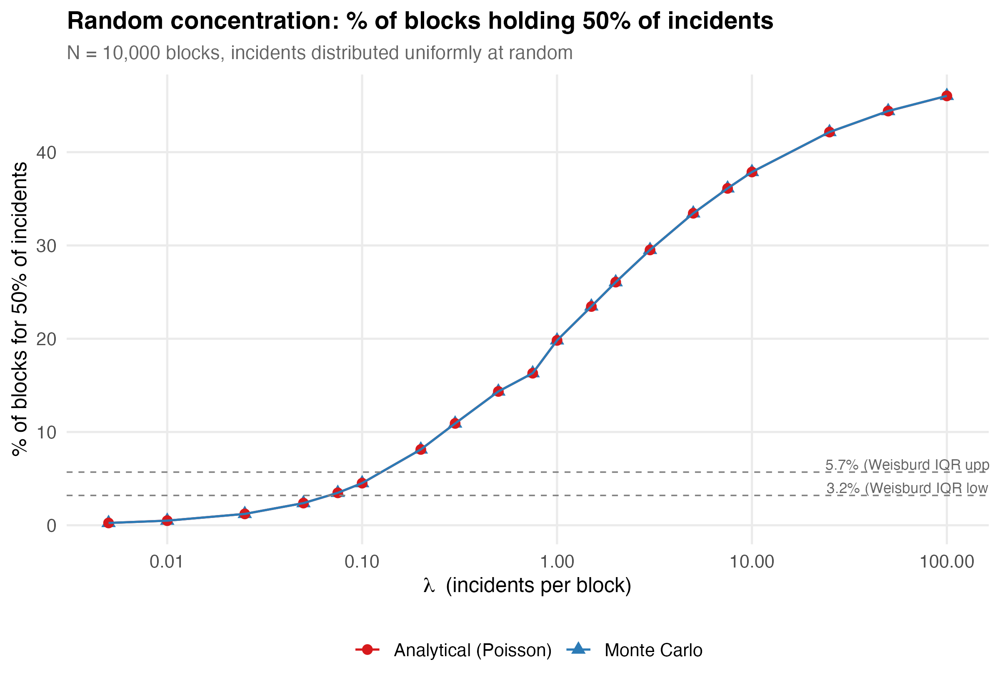
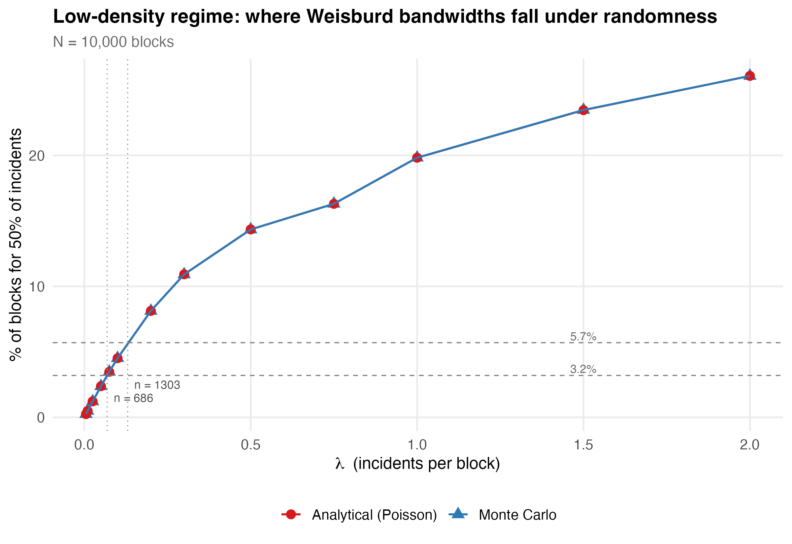

# The Null Concentration Baseline: How Much "Concentration" Does Randomness Alone Produce?

*Analysis for: Crime Concentration in NYC*
*Date: March 2026*

---

## 1. Motivation

The "law of crime concentration" (Weisburd, 2015) holds that roughly 4--6% of street segments account for about 50% of crime, and that this ratio is remarkably stable across cities. Weisburd et al. (2024) formalize this with a systematic review of 47 papers: the median finding is 4.5% of micro-places for 50% of crime, with an interquartile range of 3.2%--5.7%.

But here is the question that Chalfin, Kaplan, and Cuellar (2021) force us to confront: **how much of that concentration is a statistical artifact of sparse data?**

The logic is simple. If you have 300 homicides spread across 89,000 blocks, then *at most* 300 blocks can have any homicides at all --- that is 0.3% of blocks accounting for 100% of the crime by construction, regardless of whether any real spatial process is at work. The standard concentration metric does not distinguish between genuine clustering and the mechanical consequence of having far more places than events.

This analysis builds a **null concentration baseline**: if incidents were distributed completely at random across blocks --- no hot spots, no spatial structure, no concentration whatsoever --- what would the standard metric report?

---

## 2. The Toy Example: 10,000 Hypothetical Blocks

We start with a simplified setup to build intuition. Take N = 10,000 hypothetical street blocks and distribute *n* incidents uniformly at random (each incident independently assigned to a block with equal probability). Then rank the blocks by count and ask: what percentage of blocks accounts for 50% of all incidents?

We approach this two ways and compare.

### 2.1 Monte Carlo Simulation

The brute-force approach. For each value of *n*, repeat 500 times:

1. Draw *n* block assignments uniformly at random from {1, ..., 10,000}
2. Tabulate counts per block
3. Sort descending, compute cumulative share
4. Record the fraction of blocks needed to reach 50% of incidents

Average across replications. This is the direct empirical answer --- no modeling assumptions beyond the randomization itself.

### 2.2 Analytical Solution (Poisson)

Assigning *n* incidents uniformly at random to *N* blocks with replacement means each block's count follows a Poisson distribution with rate lambda = n/N. This lets us compute the answer exactly, without simulation.

**The key identity.** For X ~ Poisson(lambda):

> The share of total incidents on blocks with count >= k equals P(X >= k-1)

This follows from a telescoping property of the Poisson: the sum of j * P(X=j) over j >= k equals lambda * P(X >= k-1). You can verify it by substituting the PMF and re-indexing.

**Handling ties.** Because the Poisson is discrete, the "top *p* fraction" of blocks won't land cleanly at an integer threshold. We find the critical count k\* where P(X >= k\*) is just below our target fraction, then fill the remainder from the (k\*-1) tier:

- Incident share from blocks with count >= k\* is P(X >= k\*-1)
- We include a fraction *f* of the (k\*-1) tier to reach exactly 50% of incidents
- The block share is P(X >= k\*) + f * P(X = k\*-1)

This gives an exact closed-form answer for any lambda.

**Special case (small lambda).** When lambda is small --- which covers the regime relevant to the Weisburd bandwidth --- k\* = 2 and the equation simplifies beautifully to:

> e^{-lambda} = (1 - p) - (1 - q) * lambda

where *p* is the fraction of blocks and *q* = 0.50 is the target incident share. This is a single transcendental equation, trivially solved numerically.

### 2.3 Comparison: Monte Carlo vs. Analytical

The two methods agree to four decimal places across the full range of incident counts, from *n* = 50 to *n* = 1,000,000:

| Incidents (*n*) | lambda | Monte Carlo | Analytical | Difference |
|---:|---:|---:|---:|---:|
| 50 | 0.005 | 0.249% | 0.249% | ~0.000% |
| 100 | 0.01 | 0.495% | 0.495% | ~0.000% |
| 500 | 0.05 | 2.38% | 2.38% | ~0.001% |
| 1,000 | 0.1 | 4.52% | 4.52% | ~0.005% |
| 5,000 | 0.5 | 14.3% | 14.3% | ~0.003% |
| 10,000 | 1.0 | 19.8% | 19.8% | ~0.007% |
| 100,000 | 10.0 | 37.9% | 37.9% | ~0.002% |
| 1,000,000 | 100.0 | 46.0% | 46.0% | ~0.006% |

*(N = 10,000 blocks; Monte Carlo: 500 replications per row)*

**Why do they match?** Because the Monte Carlo *is* the Poisson process. Uniform random assignment with replacement produces exactly Poisson-distributed counts per block. The analytical solution is not an approximation --- it is the exact expected value of the Monte Carlo. The only difference is sampling noise, which vanishes with enough replications.

*Figure 1. Monte Carlo (blue triangles) and analytical Poisson (red circles) produce identical null concentration curves. The Weisburd IQR (3.2%--5.7%) is shown as dashed lines. N = 10,000 blocks.*

### 2.4 Key Result from the Toy Example

For 10,000 blocks, the Weisburd bandwidth (3.2%--5.7% of places holding 50% of incidents) is reached under pure randomness at:

- **3.2%** of blocks = 50% of incidents when *n* = **686** (lambda = 0.069)
- **5.7%** of blocks = 50% of incidents when *n* = **1,303** (lambda = 0.130)

Monte Carlo verification (2,000 replications) confirmed both values exactly.

*Figure 2. Zoomed view of the low-density regime where the Weisburd bandwidth falls. The dotted vertical lines mark the incident counts that produce 3.2% and 5.7% concentration under randomness. N = 10,000 blocks.*

---

## 3. Scaling to NYC: 89,292 Physical Blocks

New York City has **89,292 physical blocks**. We now apply the analytical solution at this scale to answer the question directly: for each crime type in the NYC data, how does the observed number of incidents compare to the null?

### 3.1 The Null Concentration Curve

Using the analytical Poisson solution with N = 89,292, we compute the null concentration (% of blocks for 50% of incidents) across a dense grid of incident counts from 100 to 5,000,000.

*Figure 3. The null concentration curve for NYC's 89,292 physical blocks. The shaded band marks the Weisburd bandwidth (3.2%--5.7%). Red dots mark the incident counts that produce each threshold under pure randomness. Any crime type whose total incident count falls to the left of these markers will show Weisburd-level concentration even if crime is distributed completely at random.*

### 3.2 Key Thresholds

| % of blocks for 50% of incidents | Random *n* needed | lambda (per block) | Note |
|---:|---:|---:|:---|
| 1.0% | 1,823 | 0.020 | |
| 2.0% | 3,725 | 0.042 | |
| **3.2%** | **6,125** | **0.069** | **Weisburd IQR lower bound** |
| **4.5%** | **8,893** | **0.100** | **Weisburd median** |
| 5.0% | 10,011 | 0.112 | |
| **5.7%** | **11,631** | **0.130** | **Weisburd IQR upper bound** |
| 10.0% | 23,564 | 0.264 | |
| 15.0% | 51,639 | 0.578 | |
| 20.0% | 90,687 | 1.016 | ~1 incident per block |
| 25.0% | 164,194 | 1.839 | |

### 3.3 Reading the Table

The table answers a simple question: **how many incidents, distributed completely at random, would it take to produce a given level of apparent concentration?**

- At lambda = 0.069 (about 6,100 incidents on 89K blocks), randomness alone produces 3.2% concentration --- the lower bound of Weisburd's IQR.
- At lambda = 0.100 (about 8,900 incidents), randomness hits 4.5% --- Weisburd's median.
- At lambda = 0.130 (about 11,600 incidents), randomness reaches 5.7% --- the upper bound.

Only when lambda approaches 1.0 (about 90,000 incidents --- roughly one per block) does the null concentration reach 20%. And you need lambda close to 2.0 (about 164,000 incidents) before 25% of blocks hold 50% of incidents under randomness. In other words, uniformity (50% of blocks for 50% of incidents) requires an enormous volume of data relative to the number of places.

---

## 4. The Punchline

For NYC's 89,292 physical blocks, **any crime type with fewer than roughly 6,000--12,000 incidents will show Weisburd-level concentration (3.2%--5.7% of blocks accounting for 50% of incidents) purely by chance**. That is the entire Weisburd bandwidth, produced by nothing more than randomly sprinkling sparse events across a large grid.

Consider the NYC data in context:

- **Homicides** (~300/year): lambda = 0.003. Randomness alone would concentrate these into far fewer than 1% of blocks. The observed concentration tells us essentially nothing about spatial structure.
- **Shootings** (~1,500/year): lambda = 0.017. Still deep in the sparse regime.
- **Robberies** (~13,000/year): lambda = 0.15. Right at the edge of the Weisburd bandwidth. Some of the observed concentration is real; some is artifact.
- **All complaints** (~500,000+/year): lambda > 5. Well past the null. Concentration at this volume is genuinely informative.

This does not mean that crime is not spatially concentrated. It almost certainly is. But it means that the standard metric --- "X% of places account for 50% of crime" --- systematically overstates the degree of concentration for rare crimes, and it cannot be interpreted at face value without comparing to the null.

The appropriate comparison, following Chalfin et al. (2021), is: **how does observed concentration compare to what randomness alone would produce at the same event volume?** The difference --- the *marginal* concentration --- is the signal. Everything else is noise dressed up as a finding.

---

## References

- Chalfin, A., Kaplan, J., & Cuellar, M. (2021). Measuring marginal crime concentration: A new solution to an old problem. *Journal of Research in Crime and Delinquency*, 58(4), 467--504.
- Weisburd, D. (2015). The law of crime concentration and the criminology of place. *Criminology*, 53(2), 133--157.
- Weisburd, D., Zastrowa, T., Kuen, K., & Andresen, M. A. (2024). Crime concentrations at micro places: A review. *Aggression and Violent Behavior*, 78.

---

*Scripts: `scripts/01-toy_concentration.R`, `scripts/02-null_concentration_curve.R`*
*Figures: `output/toy_mc_vs_analytical.png`, `output/toy_low_lambda_zoom.png`, `output/null_concentration_curve_nyc.png`*
