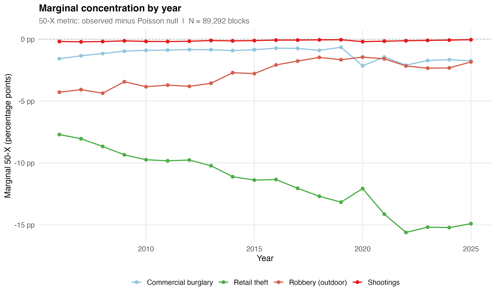
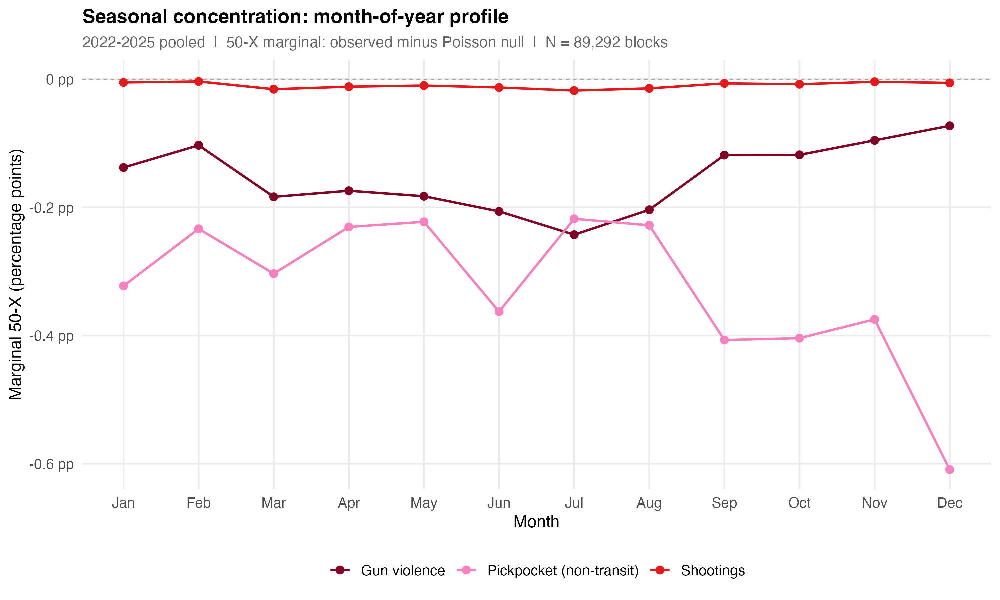
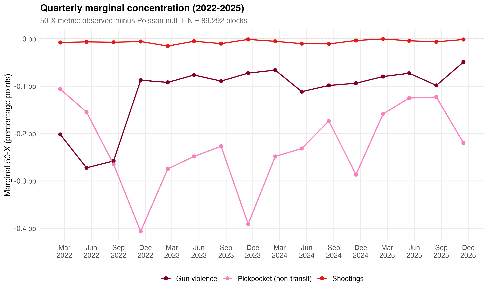
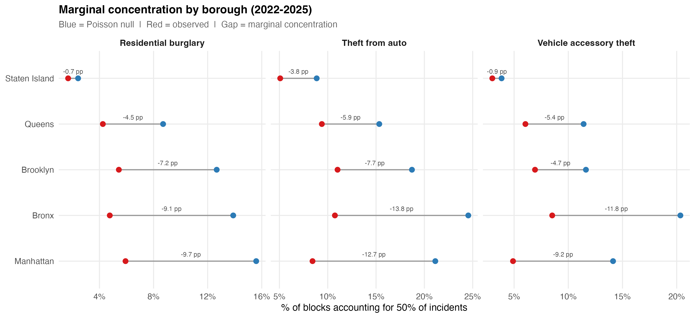

# Tier 1 Follow-Up: Temporal and Borough Disaggregations

*Analysis for: Crime Concentration in NYC*
*Date: March 2026*

---

## 1. Purpose

The main Tier 1 analysis measured marginal concentration (observed minus Poisson null) for 18 crime types using all-years pooled data. This follow-up asks three additional questions:

- **A. How does concentration evolve over time?** Annual marginal concentration for 4 crime types spanning 2006-2025.
- **B. Is there seasonality in concentration?** Month-of-year profiles (2022-2025 pooled) and quarterly time series for 3 sparse crime types.
- **C. How does concentration vary by borough?** Borough-level marginals (2022-2025) for 3 property crime types.

All methods are identical to the Tier 1 analysis: analytical Poisson null, 50-X and Gini metrics, 89,292 physical blocks in EPSG:2263.

---

## 2. Analysis A: Concentration by Year

### Crime types: Retail theft, Commercial burglary, Shootings, Robbery (outdoor)

These four types span the volume spectrum: retail theft (17K-64K/year), robbery outdoor (8K-15K/year), commercial burglary (3K-6K/year), and shootings (700-1,600/year).

### 2.1 Marginal 50-X Over Time

| Crime Type | 2006 | 2010 | 2015 | 2020 | 2025 |
|:---|---:|---:|---:|---:|---:|
| Retail theft | -7.7 pp | -9.7 pp | -11.4 pp | -12.1 pp | -14.9 pp |
| Robbery (outdoor) | -4.3 pp | -3.8 pp | -2.8 pp | -1.4 pp | -1.8 pp |
| Commercial burglary | -1.6 pp | -0.9 pp | -0.8 pp | -2.2 pp | -1.8 pp |
| Shootings | -0.2 pp | -0.2 pp | -0.1 pp | -0.2 pp | -0.04 pp |

### 2.2 Key Findings

**Retail theft concentration has been steadily increasing.** The marginal 50-X roughly doubled from -7.7 pp in 2006 to -14.9 pp in 2025. This reflects two dynamics: retail theft volume has tripled (17K to 52K incidents/year), and the new incidents are concentrating in the same commercial blocks rather than spreading to new locations. The marginal Gini tells the same story: +0.15 in 2006, +0.35 in 2025. This is the clearest example of intensifying spatial concentration over time in the NYC data.

The sharpest jump occurs between 2020 and 2022, when retail theft volume surged from 32K to 64K incidents. Even as the count doubled, the observed 50-X barely budged (staying near 0.1% of blocks), meaning the additional incidents piled onto already-hot blocks.

**Robbery (outdoor) shows stable but declining concentration.** Marginals ranged from -4.3 pp (2006) to -1.8 pp (2025), with a gradual downward trend as robbery volume declined from 15K to 9K/year. This is partly mechanical: with fewer incidents, the null becomes more concentrated, compressing the marginal gap. But the decline in marginal Gini (from +0.07 to +0.03) suggests some genuine spatial diffusion as well.

**Commercial burglary has a COVID spike.** Marginal concentration was fairly stable at -0.8 to -1.6 pp across 2006-2019, then jumped to -2.2 pp in 2020 when volume doubled (3K to 6K incidents) and clustered in commercial corridors hit during lockdowns. It has since returned toward baseline.

**Shootings show negligible marginal concentration in any single year.** The annual marginal 50-X never exceeds -0.2 pp. With 700-1,600 incidents on 89K blocks (lambda = 0.008-0.018), annual shooting concentration is statistically indistinguishable from random. The multi-year pooled marginal of -7.9 pp exists only because pooling 20 years accumulates enough volume (24K total) to reveal the spatial signal.

*Figure 1. Marginal concentration (50-X) by year for four crime types. Retail theft shows a clear upward trend in spatial concentration; shootings remain near zero at annual resolution.*

---

## 3. Analysis B: Seasonal Concentration

### Crime types: Shootings, Gun violence, Pickpocket (non-transit)

These are sparse crime types where the Tier 1 analysis showed small marginals. The question here is whether pooling by season can reveal concentration patterns invisible at annual resolution.

### 3.1 Month-of-Year Profile (2022-2025 Pooled)

Pooling all Januaries, Februaries, etc. across 2022-2025 gives ~4x the incident count of a single month.

**Shootings:**

| Month | n (pooled) | lambda | Marginal 50-X |
|:---|---:|---:|---:|
| Jan | 288 | 0.003 | -0.005 pp |
| Apr | 306 | 0.003 | -0.012 pp |
| Jul | 454 | 0.005 | -0.018 pp |
| Oct | 291 | 0.003 | -0.008 pp |

Even with 4-year pooling, shooting marginals remain negligible (all under -0.02 pp). Lambda never exceeds 0.005, far too sparse for a meaningful signal. However, there is a seasonal pattern in the marginal itself: summer months (Jun-Aug) show slightly larger marginals than winter. This is consistent with higher summer volume producing slightly more detectable clustering, though the absolute magnitudes are too small to draw strong conclusions.

**Gun violence** (shootings + shots fired):

| Month | n (pooled) | lambda | Marginal 50-X |
|:---|---:|---:|---:|
| Jan | 1,030 | 0.012 | -0.14 pp |
| Apr | 1,123 | 0.013 | -0.17 pp |
| Jul | 1,360 | 0.015 | -0.24 pp |
| Oct | 1,002 | 0.011 | -0.12 pp |

Adding shots fired data roughly triples the count, and the seasonal pattern becomes clearer. July shows the largest marginal (-0.24 pp), December the smallest (-0.07 pp). The summer peak in gun violence is well-established; what the concentration analysis adds is that summer gun violence is also slightly more spatially concentrated than winter gun violence, even after adjusting for volume differences through the null.

**Pickpocket (non-transit):**

| Month | n (pooled) | lambda | Marginal 50-X |
|:---|---:|---:|---:|
| Jan | 891 | 0.010 | -0.32 pp |
| Jun | 911 | 0.010 | -0.36 pp |
| Sep | 1,002 | 0.011 | -0.41 pp |
| Dec | 1,274 | 0.014 | -0.61 pp |

Pickpocket (non-transit) shows the most pronounced seasonal pattern. Concentration peaks in fall/winter (Sep-Dec), with December standing out at -0.61 pp marginal. This likely reflects holiday season crowding in commercial districts and transit hubs concentrating pickpocketing into a smaller set of high-foot-traffic blocks. The December count (1,274 pooled) is 40% higher than the summer average, and the additional incidents are tightly concentrated rather than spread across new locations.

### 3.2 Quarterly Time Series (2022-2025)

The quarterly analysis preserves both seasonal and year-over-year dynamics with ~3x the power of monthly slices.

**Shootings** — Marginals range from -0.004 pp (2025-Q1) to -0.016 pp (2022-Q1). No meaningful trend or seasonal pattern detectable at this resolution. The signal is simply too sparse.

**Gun violence** — Shows a clearer picture:

| Quarter | Marginal 50-X Range |
|:---|:---|
| Q1 (Jan-Mar) | -0.07 to -0.20 pp |
| Q2 (Apr-Jun) | -0.07 to -0.27 pp |
| Q3 (Jul-Sep) | -0.10 to -0.26 pp |
| Q4 (Oct-Dec) | -0.05 to -0.16 pp |

Q2 and Q3 (summer) consistently show larger marginals than Q4 (winter). There's also a year-over-year decline: 2022 marginals (~0.20-0.27 pp) are roughly double 2025 marginals (~0.08-0.14 pp), tracking the overall decline in gun violence volume.

**Pickpocket (non-transit)** — Shows the clearest trends:

| Quarter | Marginal 50-X Range |
|:---|:---|
| Q1 (Jan-Mar) | -0.11 to -0.27 pp |
| Q2 (Apr-Jun) | -0.13 to -0.25 pp |
| Q3 (Jul-Sep) | -0.12 to -0.26 pp |
| Q4 (Oct-Dec) | -0.22 to -0.41 pp |

Q4 marginals are consistently the largest, confirming the December/holiday concentration pattern from the month-of-year analysis. There's also a modest year-over-year decline, possibly reflecting post-pandemic normalization of pickpocketing patterns.

*Figure 2. Seasonal concentration profiles (2022-2025 pooled). Pickpocket (non-transit) shows a clear fall/winter peak; gun violence shows a summer peak; shootings alone are too sparse for a clear pattern.*

*Figure 3. Quarterly marginal concentration (2022-2025). Gun violence and pickpocket show both seasonal oscillation and year-over-year trends.*

---

## 4. Analysis C: Concentration by Borough (2022-2025)

### Crime types: Residential burglary, Theft from auto, Vehicle accessory theft

These three property crimes have distinct spatial signatures. The borough decomposition tests whether concentration patterns are uniform across NYC's very different geographies.

### 4.1 Results

**Residential burglary (2022-2025):**

| Borough | n Blocks | n | lambda | Obs 50-X | Null 50-X | Marginal |
|:---|---:|---:|---:|---:|---:|---:|
| Manhattan | 8,082 | 5,718 | 0.71 | 5.93% | 15.59% | -9.66 pp |
| Bronx | 12,659 | 5,841 | 0.46 | 4.76% | 13.89% | -9.13 pp |
| Brooklyn | 20,795 | 7,965 | 0.38 | 5.43% | 12.67% | -7.24 pp |
| Queens | 33,339 | 7,287 | 0.22 | 4.25% | 8.70% | -4.45 pp |
| Staten Island | 14,381 | 733 | 0.05 | 1.68% | 2.42% | -0.74 pp |

Manhattan and the Bronx show the strongest marginal concentration (~-9.5 pp), despite Manhattan having the highest lambda (0.71) and the Bronx having a moderate one (0.46). The high Manhattan marginal reflects the borough's extreme land-use mix: residential blocks are interspersed with commercial districts, so residential burglary naturally concentrates on the residential subset. Brooklyn is intermediate (-7.2 pp). Queens, with the most blocks (33K) and moderate volume, shows -4.5 pp. Staten Island's marginal is negligible — only 733 incidents on 14K blocks produces concentration indistinguishable from random.

**Theft from auto (2022-2025):**

| Borough | n Blocks | n | lambda | Obs 50-X | Null 50-X | Marginal |
|:---|---:|---:|---:|---:|---:|---:|
| Bronx | 12,659 | 22,523 | 1.78 | 10.74% | 24.55% | -13.80 pp |
| Manhattan | 8,082 | 9,079 | 1.12 | 8.43% | 21.13% | -12.71 pp |
| Brooklyn | 20,795 | 18,974 | 0.91 | 11.02% | 18.72% | -7.70 pp |
| Queens | 33,339 | 22,495 | 0.67 | 9.39% | 15.33% | -5.94 pp |
| Staten Island | 14,381 | 3,216 | 0.22 | 5.08% | 8.86% | -3.77 pp |

The Bronx leads with -13.8 pp, reflecting extreme clustering of auto theft in specific neighborhoods (Fordham, Hunts Point, Soundview). Manhattan's -12.7 pp is notable given it has the fewest blocks. All boroughs show substantial marginals, even Staten Island (-3.8 pp), making theft from auto the most geographically consistent of the three types.

**Vehicle accessory theft (2022-2025):**

| Borough | n Blocks | n | lambda | Obs 50-X | Null 50-X | Marginal |
|:---|---:|---:|---:|---:|---:|---:|
| Bronx | 12,659 | 13,240 | 1.05 | 8.52% | 20.34% | -11.82 pp |
| Manhattan | 8,082 | 3,884 | 0.48 | 4.90% | 14.13% | -9.23 pp |
| Queens | 33,339 | 10,708 | 0.32 | 6.04% | 11.41% | -5.37 pp |
| Brooklyn | 20,795 | 6,881 | 0.33 | 6.93% | 11.63% | -4.70 pp |
| Staten Island | 14,381 | 1,204 | 0.08 | 2.99% | 3.85% | -0.86 pp |

Vehicle accessory theft (including catalytic converter theft) is heavily concentrated in the Bronx (-11.8 pp), which also has the highest lambda (1.05). Manhattan shows strong concentration (-9.2 pp) despite lower volume, suggesting a small number of blocks bear most of the burden. Queens and Brooklyn are moderate (-5 pp), and Staten Island is near-noise.

### 4.2 Cross-Crime Borough Patterns

| Borough | Resid. Burg. | Theft from Auto | Veh. Acc. Theft |
|:---|---:|---:|---:|
| Manhattan | -9.66 pp | -12.71 pp | -9.23 pp |
| Bronx | -9.13 pp | -13.80 pp | -11.82 pp |
| Brooklyn | -7.24 pp | -7.70 pp | -4.70 pp |
| Queens | -4.45 pp | -5.94 pp | -5.37 pp |
| Staten Island | -0.74 pp | -3.77 pp | -0.86 pp |

The borough ranking is remarkably consistent: Manhattan and the Bronx lead, Brooklyn is intermediate, Queens is modest, and Staten Island shows minimal marginal concentration. This ordering persists across all three property crime types, suggesting that the geographic structure driving concentration is shared across crime categories — likely reflecting the density and land-use heterogeneity that distinguishes inner-city from outer-borough geography.

Theft from auto shows the largest marginals overall, reflecting its tendency to cluster along specific commercial corridors and parking-heavy streets. Residential burglary and vehicle accessory theft show similar magnitudes, though with different Bronx-Manhattan rankings.

*Figure 4. Marginal concentration by borough (2022-2025) for three property crime types. Consistent pattern: Manhattan and Bronx lead, Staten Island shows near-null concentration.*

---

## 5. Summary

**Temporal dynamics matter.** Retail theft concentration has been increasing for two decades and shows no sign of plateauing. Commercial burglary had a COVID-era spike. Robbery (outdoor) is gradually declining. Shootings are too sparse for annual-resolution analysis.

**Seasonality exists but is faint.** For gun violence, summer months show modestly higher marginal concentration than winter. For pickpocketing, fall/winter (especially December) shows the strongest concentration, likely reflecting holiday crowding. For shootings alone, no seasonal pattern is detectable — the crime is simply too rare for monthly or even seasonal resolution to work.

**Borough patterns are consistent.** Manhattan and the Bronx show the strongest marginal concentration for all three property crime types tested. This reflects their land-use density and heterogeneity: a Manhattan block can be residential, commercial, or mixed, creating sharp spatial gradients in crime risk. In contrast, Queens and Staten Island have more homogeneous land use, producing weaker concentration signals.

**The power problem is real.** Sparse crime types (shootings, pickpocketing) require substantial temporal pooling before marginal concentration emerges from noise. At monthly resolution, shooting concentration is pure artifact. At quarterly resolution, it's still negligible. Only multi-year pooling or geographic subsetting (Analysis C) can reveal real spatial structure for rare crimes.

---

## References

- Chalfin, A., Kaplan, J., & Cuellar, M. (2021). Measuring marginal crime concentration. *Journal of Research in Crime and Delinquency*, 58(4), 467-504.
- Weisburd, D. (2015). The law of crime concentration and the criminology of place. *Criminology*, 53(2), 133-157.

---

*Script: `scripts/04-temporal_borough_concentration.R`*
*Data: NYPD Complaint Data, Shootings, Shots Fired on 89,292 physical blocks (EPSG:2263)*
