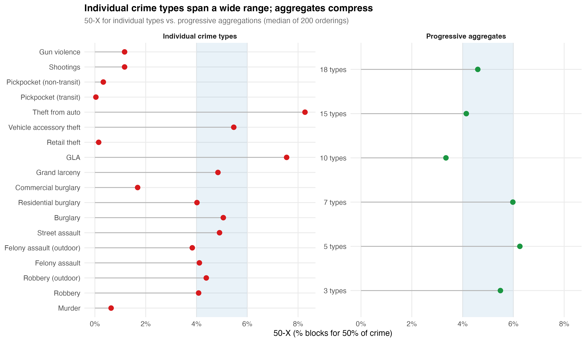

# Crime Concentration at Micro-Places: What We Know, What We Measure, and What It Means

---

## I. A Place to Stand

> "Our more precise geographic concept of place can be defined as a fixed physical environment that can be seen completely and simultaneously, at least on its surface, by one's naked eyes."
> — Sherman, Gartin, & Buerger (1989)

A small share of places accounts for a large share of crime. In Minneapolis in 1986, 3% of addresses generated 50% of police calls --- and crime was six times more concentrated by place than by individual offender (Sherman et al., 1989). In Seattle over 14 years, 4--5% of street segments produced roughly half of all crime incidents, year after year, even as the citywide total dropped by 24% (Weisburd et al., 2004). A systematic review of 47 studies reported a median of 4.5% of street segments for 50% of crime, with an interquartile range of 3.2--5.7% (Weisburd et al., 2024). The finding replicates across Vancouver, The Hague, Tel Aviv, Chicago, Boston, St. Louis, and a dozen more cities. It is one of the most cited empirical regularities in modern criminology.

It is also, as this chapter argues, one of the most misunderstood. The concentration finding is real. The question is what it tells us --- and what it does not.

For the Every Block Counts trial to work, three things must be true, and they come in order. First, crime must be persistent: a block that is dangerous this year must still be dangerous next year, or sending resources there is chasing a pattern that has already moved on. Second, crime should be concentrated: a small number of blocks should carry a large share of harm. But concentration only matters if it lasts --- a snapshot is not enough. Crime clustered at a few blocks in one period and scattered across different blocks in the next is noise dressed up as a pattern. What the intervention needs is *persistent concentration* --- the same blocks, carrying the same burden, period after period. Third, crime must yield to the interventions employed. Persistence tells you where to go. Concentration tells you it is feasible. Amenability tells you it is worth going. If the mechanisms producing harm at a block do not respond to what officers and partners actually do there, the first two conditions are a well-drawn map to a locked door.

This chapter examines the first two conditions in detail. It traces the history of the concentration idea, interrogates what standard metrics actually measure, presents the most comprehensive null-adjusted concentration analysis of NYC micro-places conducted to date, and argues that the field's most popular statistic --- the 50-X metric --- is rhetorically powerful but analytically limited. The chapter then extends the analysis to show that concentration is not a single phenomenon but a family of crime-type-specific patterns, each with distinct generating processes, and that aggregating them into a single index obscures more than it reveals. It closes by connecting these findings to the harm-weighted framework that Every Block Counts requires.

---

## II. History of an Idea

### The Prehistory: Frightful Regularity

The spatial study of crime is old. Adolphe Quetelet's 1842 *Treatise on Man* is frequently cited as the origin of empirical criminology. Alongside André-Michel Guerry, Quetelet published some of the first maps of personal and property crime in France, showing that crime rates varied systematically across regions and were linked to ecological and social characteristics. His observation of "une régularité effrayante" --- frightful regularity --- captures the discovery that crime is not random but patterned, persistent, and predictable:

> "There is a budget which we pay with frightful regularity --- it is that of prisons, dungeons, and scaffolds. We might even predict annually how many individuals will stain their hands with the blood of their fellow men, how many will be forgers, how many will deal in poison."

This was radical. In an era when crime was understood as moral failing, Quetelet argued that it was regular enough to model statistically --- determinism creeping into what had been the domain of sin and free will. He is the intellectual forefather of everything that follows.

For the next century and a half, the unit of analysis remained coarse. Mayhew (1862) mapped London's rookeries. Shaw and McKay (1942) demonstrated that delinquency rates in Chicago neighborhoods remained stable even as ethnic composition turned over entirely --- social disorganization was a property of places, not people. But the "place" in question was still the neighborhood: hundreds or thousands of addresses treated as a single unit.

### The Opportunity Turn

Three theoretical currents shifted attention from offender motivation to situational opportunity. Jane Jacobs (1961) argued in *The Death and Life of Great American Cities* that the physical design of streets and buildings shapes informal social control at a granularity far below the neighborhood. Busy sidewalks with mixed uses generate "eyes on the street" --- natural surveillance that deters crime. This was the first influential argument that micro-level physical features of places matter for crime, independent of who lives there.

Cohen and Felson (1979) proposed routine activities theory: crime requires the convergence in space and time of a motivated offender, a suitable target, and the absence of a capable guardian. The theory was originally macrosociological, but its spatial logic was immediately applicable to micro-places. If crime requires convergence, then the places where these elements reliably intersect should concentrate crime.

Brantingham and Brantingham (1993) introduced crime pattern theory --- nodes, paths, and edges --- explaining geometrically why crime clusters at predictable locations: transit hubs, commercial corridors, the boundaries between land uses. Clarke (1995) gave the framework practical substance with situational crime prevention, demonstrating that modifying the immediate environment could reduce offending at specific locations with minimal displacement.

These streams converged on a common departure from the neighborhood tradition. A single neighborhood could contain blocks with dozens of annual incidents alongside blocks with none. The insight that drove the micro-place turn was that the neighborhood average conceals this heterogeneity, and that the heterogeneity itself is where the explanatory action lies.

### The Empirical Breakthrough

Sherman, Gartin, and Buerger (1989) delivered the empirical proof. Analyzing 323,000 calls for service in Minneapolis, they showed that crime was not just concentrated --- it was *more* concentrated by place than by person. Sherman proposed that places have "criminal careers" with onset, persistence, and desistance, and that place-focused interventions are more tractable than offender-level strategies because places are stationary and experimentally manipulable.

Sherman also did something that the field would largely forget for the next quarter century. He included a Poisson model benchmark --- a comparison of the observed concentration of 911 calls against their expected distribution under randomness. He recognized that when the number of places vastly exceeds the number of crimes, high concentration is "mathematically inevitable." The caution was prescient. It was also ignored.

### Formalization as a "Law"

Weisburd, Bushway, Lum, and Yang (2004) conducted the foundational longitudinal study: 29,849 street segments in Seattle over 14 years. The central result was stability --- 84% of segments maintained consistent crime levels, and the citywide crime drop was driven by a small group of declining micro-places rather than a generalized reduction. Weisburd (2015), in his Sutherland Address, formalized the finding as the "law of crime concentration at places": for a defined measure of crime at a specific micro-geographic unit, the concentration of crime will fall within a narrow bandwidth of percentages.

The word "law" was deliberately provocative. Weisburd meant to signal an empirical regularity robust enough to guide both theory and policy. The subsequent replication wave --- Vancouver (Curman et al., 2015), Albany (Wheeler et al., 2016), six U.S. cities (Walter et al., 2023), eight cities on common metrics (Spencer & Schnell, 2022), 47 studies in systematic review (Weisburd et al., 2024) --- confirmed the core pattern. It also raised complications that the law's clean framing did not fully anticipate.

---

## III. What the Standard Metric Actually Measures

### The 50-X: Rhetorical Punch, Analytical Limits

The most common formulation of crime concentration is the 50-X metric: what percentage of places accounts for 50% of crime? Weisburd (2015) used it to define the law --- 4--6% of street segments. Weisburd et al. (2024) used it in their systematic review (median 4.5%, IQR 3.2--5.7%). It has become the field's common currency.

The 50-X has genuine virtues. It is simple. It is intuitive. It translates directly into a policy-relevant statement: this is how much of the city you need to target to reach half the crime. And it conveys a real point about urban life --- crime is sparse. On the vast majority of blocks in any city, serious crime does not happen in any given year. Randomly allocated or not, the metric communicates that murder does not occur on the vast majority of blocks. It conveys a low, distributed sense of risk.

What it does not do is measure concentration.

### The Sparse-Data Problem

The fundamental issue is arithmetic. When the number of spatial units far exceeds the number of crime events --- the default condition for every serious crime type --- standard concentration metrics mechanically produce concentrated distributions. NYC has 89,292 physical blocks and roughly 300 annual homicides. Even under a perfectly random allocation of murders to blocks, the vast majority of blocks will have zero murders, a handful will have one, and the resulting distribution will look concentrated. The apparent concentration is a mathematical inevitability, not evidence of a spatial process.

Sherman saw this in 1989. The field did not act on it for decades.

Chalfin, Kaplan, and Cuellar (2021) finally forced the confrontation. They proposed a randomization-based counterfactual --- the concentration that would be expected if crimes were distributed uniformly at random --- and defined *marginal crime concentration* as the difference between the observed value and this null. The marginal captures the genuine spatial signal after removing the artifact. For common crimes, the correction is small and observed concentration is largely real. For rare crimes, the correction is enormous.

Bernasco and Steenbeek (2017) arrived at the same conclusion through a different route: standard Gini coefficients are biased upward when places outnumber events. Mohler et al. (2019) demonstrated the bias parametrically using Poisson-Gamma estimation. The common thread is clear: the field's signature finding is overstated for rare crime types by an amount that depends on the ratio of places to incidents.

### What Our Data Show

We computed the analytical Poisson null concentration for NYC's 89,292 physical blocks across the full range of possible crime volumes. The result is a curve that maps, for any given number of incidents, how concentrated a purely random distribution would appear.

The curve establishes a threshold: any crime type producing fewer than approximately 6,000--12,000 incidents citywide will fall within the Weisburd bandwidth (3.2--5.7%) under pure randomness. This means that for homicides (~8,200 incidents over 20 years, ~400/year), transit pickpocketing (~6,200), and several other categories, the conventional 50-X metric tells you almost nothing about genuine spatial processes. The number lands inside the "law" range even if crimes rain down at random.

We then applied the Chalfin framework to 18 specific crime types, spanning the full volume spectrum from grand larceny (880,000 incidents) to transit pickpocketing (6,200). The results are summarized in the marginal concentration dotplot:

The hierarchy that emerges is not the one the conventional metric produces. Under the standard 50-X, murder appears to be the most concentrated crime (0.05% of blocks). Under the marginal framework, murder has the *weakest* genuine concentration --- a marginal of only -4.13 percentage points --- because nearly all its apparent concentration is artifact. Retail theft, by contrast, is the most genuinely concentrated crime type: a marginal of -35.92 pp, meaning that observed concentration exceeds the random baseline by 36 percentage points. The Chalfin framework does not merely adjust the numbers. It reorders the ranking entirely.

The Gini comparison makes the point visually. Observed Gini coefficients are above 0.95 for nearly every crime type --- they all "look" concentrated. But the null Gini is also extremely high for sparse types. The marginal Gini --- the gap between observed and null --- ranges from +0.781 (retail theft) to +0.072 (murder). That is a ten-fold range in genuine concentration, completely invisible under standard metrics.

### The Bandwidth Is Not Narrow

Much is made of arriving at a narrow bandwidth to describe crime concentration. The Weisburd systematic review reports a tight IQR of 3.2--5.7%. But this tightness is partly a product of several forces that compress the number:

**Sparse data.** For rare crimes, the 50-X will land inside the bandwidth regardless of the spatial distribution, because randomness alone produces those values. Including rare crime types in a cross-study comparison tightens the bandwidth mechanically.

**Aggregation.** Most studies use aggregate crime indices --- total Part 1 offenses, "all crime," broad categories like "violent crime." Aggregating crime types with imperfectly correlated spatial distributions compresses concentration metrics toward a narrow range through portfolio diversification, volume dominance, and zero-inflation reduction. A place that is a hotspot for robbery but not burglary will appear less concentrated in a combined index than in either type alone.

**Metric choice.** Andresen and Weisburd (2025) showed that some of the apparent disagreement about the bandwidth is attributable to metric selection. The inverted 5-X metric (Hipp & Kim, 2017) produces artificially wide bandwidths; converting all estimates to 50-X restores narrower ranges. But this is a statement about the metric, not about the phenomenon.

Our NYC data demonstrate that within a single city, the 50-X for specific crime types ranges from 0.05% (murder) to 10.4% (felony assault) --- a 200-fold range. This is not a narrow bandwidth. It is not even in the same neighborhood as a narrow bandwidth. The tightness of the canonical range is an artifact of how the calculation is set up, not a property of how crime distributes in cities.

---

## IV. Why Concentration Is Overdetermined

Even after correcting for sparse data, the genuine spatial signal in crime concentration may be less distinctively *about crime* than the field assumes.

### The Eck Challenge

Eck, Lee, O, and Martinez (2017) asked the most disruptive question in the concentration literature: compared to what? They showed that crime concentrates at roughly the same level as hospital visits, traffic accidents, code violations, and many other spatial phenomena. The J-curve distribution that characterizes crime concentration is practically universal in spatial data. If concentration is a generic property of any spatially distributed count variable, then the policy implications change. The argument for hot spots policing rests partly on the claim that crime is *unusually* concentrated. If everything concentrates similarly, the efficiency argument weakens.

### Network Topology

Space syntax research (Hillier et al., 1993; Hillier & Sahbaz, 2008) demonstrates that the configuration of the urban grid is itself a primary generator of pedestrian flow patterns. Some streets are topologically more integrated --- requiring fewer direction changes to reach all other streets --- and these streets attract disproportionate movement purely as a function of network structure. Davies and Johnson (2015) showed that betweenness centrality is a highly significant predictor of burglary risk at the street-segment level, even after controlling for socio-demographics. Summers and Johnson (2017) found the same for outdoor serious violence in London.

For NYC's physical blocks, this is directly relevant. The grid varies enormously in integration values --- the difference between a through-block in Midtown and a dead-end residential street in eastern Queens. That topological variation alone would produce concentration of any activity correlated with pedestrian flow.

### Urban Scaling Laws

Bettencourt et al. (2007) showed that social outputs --- wages, patents, GDP, and explicitly crime --- scale superlinearly with city population (exponent ~1.15). Bettencourt (2013) derived this theoretically: cities are social reactors where interaction density increases faster than population. The prediction is that *all* social outputs concentrate at high-density, high-connectivity places. Crime concentration becomes a corollary of a general law about how social interaction scales with spatial density.

Oliveira (2021) extended this across 12 countries, showing that theft scales superlinearly while burglary scales roughly linearly --- crime-type-specific scaling that parallels the crime-type-specific concentration in our micro-place data.

### Multiplicative Processes

Clauset, Shalizi, and Newman (2009) showed that power-law distributions appear across an enormous range of phenomena. Mitzenmacher (2004) demonstrated that multiplicative processes --- where a quantity grows by random proportional increments --- produce lognormal distributions nearly indistinguishable from power laws. Crime accumulation at a block is plausibly multiplicative: each additional commercial establishment or transit connection multiplies opportunity rather than adding to it linearly. The resulting distribution would appear concentrated regardless of any spatial clustering mechanism.

Phillips (2022) formalized the implication as equifinality: the same distributional outcome can be produced by multiple distinct generative processes. A power-law concentration pattern is consistent with routine activities, social disorganization, network centrality, and pure stochastic accumulation simultaneously. The distribution alone cannot identify the mechanism.

### The Synthesis

Crime concentration at micro-places is overdetermined. It would emerge from:

1. **The occupancy problem** --- when crimes are rare relative to places, standard metrics mechanically inflate concentration.
2. **Network topology** --- streets with higher integration attract disproportionate flow, and therefore crime, as a property of the street graph.
3. **Superlinear scaling** --- all social outputs concentrate at high-density places as a mathematical consequence of urban interaction dynamics.
4. **Multiplicative accumulation** --- any quantity that grows proportionally produces heavy-tailed distributions.
5. **Economic agglomeration** --- commercial activity self-reinforces at specific locations, and crime opportunity follows.

The marginal concentration framework strips away (1). But (2) through (5) remain as non-criminological explanations that the field has not systematically engaged with. The concentration finding is being asked to carry enormous theoretical and policy weight, but mathematically, it may be telling us very little about crime specifically.

---

## V. Crime Types Are Not the Same Phenomenon

### The Aggregation Problem

The most consequential measurement issue after sparse data is that "crime" is not a natural kind. It is an administrative and legal category that bundles together behaviors with nothing in common except that the state has decided to prohibit them. Robbery is driven by economic desperation and opportunity structure. Domestic assault is driven by relationship dynamics and substance use. Auto theft is driven by resale markets and anti-theft technology. A "crime rate" that sums them is a number that no single intervention can move coherently.

This is not an abstract philosophical concern. It has immediate analytical consequences. A policy might push one component down and leave others untouched, and the aggregate barely budges. Or two countervailing shifts cancel out and the index reads "stable" while the underlying reality has changed. The revision dynamics in NYC's monthly crime statistics illustrate this precisely: transit crime revisions run at ~11% while the overall number looks modest, because the aggregate smooths over the one category where reporting is most unstable.

The closest formal articulation is from econometrics, where Theil (1954) showed that when you aggregate structural equations with different functional forms and different explanatory variables, the aggregate coefficients are not averages of the micro-coefficients --- they can be completely unrelated to any of them. Arrow's (1951) impossibility theorem demonstrates the same principle for preference aggregation: coherent individual rankings do not necessarily produce a coherent collective ranking. In epidemiology, the point is so well understood that nobody publishes a paper on "total disease" as though cancer, influenza, and diabetes are a single phenomenon. Criminology, by contrast, routinely treats "total crime" or "index crime" as a meaningful dependent variable and tries to explain it with a single model.

### What Our Data Show About Type-Specific Concentration

The 18 crime types in our NYC analysis produce radically different concentration profiles:

| Crime Type | Incidents | Observed 50-X | Null 50-X | Marginal (pp) | Marginal Gini |
|---|---|---|---|---|---|
| Retail theft | 675,073 | 0.21% | 36.13% | -35.92 | +0.781 |
| Grand larceny | 880,025 | 5.04% | 37.75% | -32.71 | +0.626 |
| Felony assault | 399,783 | 4.76% | 33.22% | -28.46 | +0.570 |
| Robbery | 229,614 | 5.60% | 29.51% | -23.91 | +0.489 |
| Outdoor robbery | 150,854 | 3.41% | 26.09% | -22.68 | +0.468 |
| Shootings | 17,393 | 1.32% | 8.37% | -7.05 | +0.153 |
| Murder | 8,192 | 0.05% | 4.18% | -4.13 | +0.072 |
| Transit pickpocket | 6,251 | 0.06% | 3.20% | -3.14 | +0.057 |

The range is enormous. Retail theft is 9 times more genuinely concentrated than shootings and 10 times more than murder. Under the conventional metric, murder *appears* the most concentrated (0.05% of blocks). Under the marginal framework, it is among the least. The Chalfin framework does not just adjust the numbers; it inverts the ranking.

The Lorenz curves make the mechanism visible. For high-volume types like retail theft, the observed curve separates dramatically from the null --- a wide gap that represents genuine spatial process. For murder, the observed and null curves nearly overlap. The gap is real but thin: most of what looks like concentration is the occupancy problem at work.

### Overlapping Opportunity Structures

Environmental criminologists (Brantingham & Brantingham, 1993; Andresen et al., 2017) have long argued that different crimes require different opportunity structures. Commercial burglaries cluster in retail corridors. Aggravated assaults cluster around entertainment districts. Auto thefts cluster near commuter parking lots. When you blend them into "total crime," the geographic center of a city --- which naturally contains retail, bars, and parking --- lights up as a massive hot spot. It appears as though there is a universal "criminogenic" quality to those few street segments. In reality, you are overlapping entirely unrelated micro-environments.

Andresen et al. (2017) tested this directly in Vancouver, finding that while crime is always concentrated regardless of type, the types do not cluster in the same places. Our cross-type concordance analysis for NYC confirms partial but imperfect overlap:

Of the 1,125 blocks in the chronic-high trajectory for 7 Major Felonies, 53% were also in the highest robbery group and 64% in the highest larceny group. But the correspondence is far from one-to-one. The chronic hot spots are driven by a mix of crime types, and the mix varies from block to block.

### The Portfolio Effect

When multiple crime types with imperfectly correlated spatial distributions are summed, concentration metrics compress toward a narrow bandwidth through several mechanisms:

**Portfolio diversification.** Like financial assets, combining spatially uncorrelated crime types reduces "concentration risk." A block that is a hotspot for robbery but not burglary will appear less concentrated in a combined index than in either type alone.

**Volume dominance.** High-count crime types swamp rare types in the aggregate. In NYC, grand larceny's 880,000 incidents dominate any aggregate that includes homicide's 8,200. The aggregate concentration tracks the most common offense regardless of how other types distribute.

**Zero-inflation reduction.** Individual crime types have many zero-crime blocks. Summing types fills in zeros, pushing the distribution toward a less extreme shape.

The tight 4--6% bandwidth may be partly a property of aggregation --- a mathematical attractor rather than, or in addition to, a substantive spatial regularity. The "law" is tightest precisely when it aggregates the most.

### Aggregation for Explanation vs. Aggregation for Allocation

The critique of aggregation requires a distinction. Aggregation is philosophically incoherent *for explanation*: you cannot build a causal model of "total crime" because there is no single generating process. But aggregation is practically necessary *for allocation*: a city budget must make tradeoffs between robbery prevention and domestic violence intervention, and some common metric is better than treating every line item as incomparable.

James Scott (1998) provides the framework. In *Seeing Like a State*, he argues that the state needs to render complex social reality legible in order to act on it, and aggregation is one of the primary tools of legibility. The simplification is simultaneously necessary and dangerous --- necessary because you cannot govern what you cannot summarize, dangerous because the summary can be mistaken for the reality.

The position here is not to reject legibility but to maintain what might be called *honest legibility* --- aggregates that are transparent about what they are hiding. The policy conversation should begin with "crime is up" but immediately ask: which crimes, where, driven by what? The problem is not that NYPD tracks total index crime. The problem is when the aggregate becomes the stopping point for understanding rather than the starting point for investigation.

Epidemiology provides the model. Nobody thinks "total DALYs" represents a single phenomenon. But the DALY framework is useful for resource allocation precisely because a government health ministry has to decide how to distribute a finite budget across incommensurable problems (Murray & Lopez, 1996). The aggregation is not scientific --- it is decisional. It answers "where should attention go" rather than "what causes this." The Cambridge Crime Harm Index (Sherman et al., 2016) works on the same logic: you are not claiming that weighted crime is a natural kind, you are claiming it is a rational basis for prioritization.

---

## VI. Concentration Over Time and Space

### Temporal Stability and Its Limits

The trajectory literature established that the majority of places maintain stable crime levels over time. In our analysis of 89,292 NYC physical blocks over 19 years (2006--2024):

- **68%** of blocks followed stable trajectories --- crime-free, low-stable, moderate-stable, or high-stable
- **22.4%** of blocks (20,006) recorded zero 7 Major Felony incidents across the entire period
- **1.3%** of blocks (1,125) were chronic-high, averaging over 20 felonies per year for nearly two decades and accounting for 20.7% of all major felony crime
- Combined, **13.9%** of blocks produced **65.8%** of all major felony crime over 19 years

These findings replicate the core results from Seattle (Weisburd et al., 2004), Vancouver (Curman et al., 2015), and Albany (Wheeler et al., 2016), though with a slightly lower stability rate (68% vs. 70--84% in prior studies). The slight shortfall may reflect NYC's larger scale and greater heterogeneity, or the longer observation window capturing more temporal variation.

### But Concentration Itself Is Not Static

When we track marginal concentration over time for specific crime types, a more dynamic picture emerges:

Retail theft concentration has been steadily increasing: the marginal 50-X roughly doubled from -7.7 pp (2006) to -14.9 pp (2025), with the sharpest jump during 2020--2022 when volume surged from 32,000 to 64,000 incidents concentrating in the same commercial blocks. Robbery shows the opposite trend --- stable but declining concentration (-4.3 pp in 2006 to -1.8 pp in 2025). Shootings show negligible marginal concentration in any single year, never exceeding -0.2 pp.

The bandwidth is not consistent across time or geography within a city. It moves with the data-generating process. This is not a failure of the concentration framework --- it is information. Concentration that is increasing for retail theft and declining for robbery tells you something about how opportunity structures are shifting in the city. The law's emphasis on a stable bandwidth treats this variation as noise. It is signal.

### Borough Heterogeneity

Citywide metrics average over geographically heterogeneous areas. When we decompose marginal concentration by borough:

Manhattan leads for retail theft (-39.47 pp marginal, driven by lambda=15.4 --- the largest single value in the entire analysis). The Bronx leads for shootings (-3.33 pp). Queens and Staten Island show near-zero shooting marginals --- their apparent concentration is almost entirely sparsity artifact. Transit pickpocketing is essentially a Manhattan-only phenomenon.

The citywide 50-X is a potentially misleading summary of these heterogeneous patterns. O'Brien et al. (2022) showed the same in Boston: two neighborhoods with identical crime rates can have very different concentration profiles. The concentration is not a property of the city. It is a property of specific places within specific parts of the city, for specific crime types.

### Spatial Heterogeneity Within Neighborhoods

The micro-place thesis claims that crime varies dramatically within neighborhoods --- that "good blocks" exist adjacent to "bad blocks." Our data confirm this:

On average, **62.7%** of a block's six nearest neighbors were in a different trajectory group. For blocks in the chronic-high group, **77.7%** of neighbors followed a different trajectory. Even the most dangerous blocks in the city are typically surrounded by blocks with very different crime profiles.

Local Moran's I analysis found only **15,524 blocks (17.4%)** in statistically significant spatial clusters. The remaining 82.6% are not spatially clustered with like-trajectory neighbors. Spatial heterogeneity dominates over homogeneity at this scale.

---

## VII. The Social Construction of the Measured Phenomenon

A deeper problem sits beneath the measurement debates. Crime concentration measures the concentration of *recorded criminal incidents* --- a phenomenon that is itself socially constructed at every stage.

What counts as a crime is a legislative choice. What gets reported depends on victim behavior, cultural norms, and technological access. What gets recorded depends on police discretion, organizational incentives, and data infrastructure. What gets geocoded accurately depends on address matching algorithms and the physical layout of locations. Taylor et al. (2024) showed that 311 calls --- increasingly used as disorder proxies --- lack discriminant validity: theoretically unrelated categories (information requests) predicted physical conditions just as well as relevant categories (litter complaints). The pattern reflects a general propensity to call, not on-the-ground conditions.

The concentration finding is not a finding about crime. It is a finding about what the recording system captures. This does not make it useless --- administrative data is all we have, and it captures something real. But it means that concentration patterns reflect the interaction of crime *and* reporting *and* recording *and* geocoding, and disentangling these components is rarely attempted.

Robinson (1950) demonstrated that correlations computed at the aggregate level can differ dramatically from individual-level correlations --- the ecological fallacy. For crime concentration, the implication is that area-level patterns cannot be straightforwardly interpreted as individual-level behavioral processes. The concentration of crime at a street segment does not mean the people on that segment are more criminal. It may mean the segment has properties --- network centrality, commercial density, transit access --- that attract crime from elsewhere.

---

## VIII. What Concentration Tells Us About Harm

### From Counts to Consequences

Concentration metrics typically count incidents. A pickpocketing and a homicide count the same. This is obviously inadequate for resource allocation, and the Cambridge Crime Harm Index (Sherman et al., 2016) was developed to address it, weighting crimes by sentencing severity to produce a metric that reflects the harm a community actually experiences.

The harm-weighted framework changes the concentration picture. Homicide is rare and weakly concentrated in the marginal sense, but its harm per incident is orders of magnitude greater than theft. A block with one murder imposes more harm than a block with 50 larcenies. When the question shifts from "where does crime happen most" to "where does harm concentrate most," the answer may be different --- and the answer matters more for intervention design.

For Every Block Counts, the relevant question is not "what percentage of blocks account for 50% of incidents" but "what percentage of blocks account for 50% of harm." The distinction is not academic. It determines which blocks get resources, what interventions are deployed, and how success is measured.

### From Crime to Crime Types

The heterogeneity findings from Section V have direct implications for harm-weighted concentration. If retail theft is the most genuinely concentrated crime type but carries relatively low harm per incident, and shootings are weakly concentrated but carry high harm, then count-based and harm-based concentration profiles will diverge substantially. A block that appears unremarkable in the count-based framework may be a harm outlier because of a single homicide or a cluster of shootings. Conversely, a block that dominates the count-based rankings may be a harm-irrelevant retail theft hotspot.

The policy translation is that "hot spots" identified by incident counts and "harm spots" identified by severity-weighted counts may not overlap. Interventions designed for hot spots (high-volume, low-severity) differ from interventions designed for harm spots (low-volume, high-severity). The former might respond to environmental design and situational prevention; the latter might require violence interruption, social services, and investigative capacity.

---

## IX. What This Means for Every Block Counts

Return to the three conditions.

**Persistence.** Our trajectory analysis confirms it. The majority of NYC blocks maintain stable crime levels over 19 years, and the chronic-high group has been persistently elevated throughout. The 22.4% of blocks with zero major felonies across the entire period are persistently safe. The pattern is not noise. There is something to target.

**Concentration.** It is real but requires careful interpretation. The marginal framework shows that genuine spatial concentration is overwhelmingly a property-crime phenomenon. For shootings and homicides --- the crimes that carry the most harm and that Every Block Counts most needs to affect --- the marginal concentration is modest. This does not mean place-based intervention is futile for violence. It means that the efficiency gain is smaller than the conventional 50-X metric implies, and that the target set is less stable year-to-year. The trial design needs to account for this: the matched-pair cluster RCT needs enough harm at treated blocks to detect an effect, and diffuse harm can make a sound strategy invisible to the evaluation.

**The type-specificity problem.** If the intervention treats "crime" as a single phenomenon, it will allocate resources based on an aggregate that obscures the distinct generating processes operating at each block. A block with high retail theft needs situational prevention and environmental design. A block with shootings needs violence interruption and social service coordination. A block with both needs both --- but the aggregate count does not tell you that. The trial should be designed to measure type-specific effects, not just total-crime effects, because the aggregate can mask success on one dimension while a different dimension holds steady.

**The honest legibility principle.** The concentration finding provides the warrant for place-based intervention. The measurement critique does not undermine that warrant --- it refines it. Crime concentrates at micro-places, but the concentration varies by type, by time, and by geography. The narrow bandwidth is an artifact of aggregation and sparse data, not a law of nature. The genuine signal is strongest for property crime and weakest for the violent crime that matters most for public safety. The policy response should match the precision of the measurement: disaggregated, harm-weighted, and temporally dynamic.

---

## References

Andresen, M. A. (2006). Crime measures and the spatial analysis of criminal activity. *British Journal of Criminology*, 46(2), 258--285.

Andresen, M. A., Curman, A. S., & Linning, S. J. (2017). The trajectories of crime at places. *Journal of Quantitative Criminology*, 33(3), 427--449.

Andresen, M. A. & Weisburd, D. (2025). Ockham's razor and the measurement of crime concentrations. *Journal of Quantitative Criminology*, 41, 1--25.

Arrow, K. (1951). *Social Choice and Individual Values*. Wiley.

Bernasco, W. & Steenbeek, W. (2017). More places than crimes. *Journal of Quantitative Criminology*, 33(3), 451--467.

Bettencourt, L. M. A. (2013). The origins of scaling in cities. *Science*, 340(6139), 1438--1441.

Bettencourt, L. M. A., Lobo, J., Helbing, D., Kuhnert, C., & West, G. B. (2007). Growth, innovation, scaling, and the pace of life in cities. *PNAS*, 104(17), 7301--7306.

Brantingham, P. J. & Brantingham, P. L. (1993). Environment, routine, and situation. In R. V. Clarke & M. Felson (Eds.), *Routine Activity and Rational Choice*. Transaction Publishers.

Chalfin, A., Kaplan, J., & Cuellar, M. (2021). Measuring marginal crime concentration. *Journal of Research in Crime and Delinquency*, 58(4), 467--504.

Clarke, R. V. (1995). Situational crime prevention. *Crime and Justice*, 19, 91--150.

Clauset, A., Shalizi, C. R., & Newman, M. E. J. (2009). Power-law distributions in empirical data. *SIAM Review*, 51(4), 661--703.

Cohen, L. E. & Felson, M. (1979). Social change and crime rate trends. *American Sociological Review*, 44(4), 588--608.

Curman, A. S. N., Andresen, M. A., & Brantingham, P. J. (2015). Crime and place: A longitudinal examination of street segment patterns in Vancouver, BC. *Journal of Quantitative Criminology*, 31(1), 127--147.

Davies, T. & Johnson, S. D. (2015). Examining the relationship between road structure and burglary risk. *Journal of Quantitative Criminology*, 31, 481--507.

Diaz, R. et al. (2025). Street markets, eyes on the street, and crime. *Journal of Quantitative Criminology* [forthcoming].

Eck, J. E., Lee, Y., O, S., & Martinez, N. N. (2017). Compared to what? *Crime Science*, 6, 8.

Espeland, W. N. & Stevens, M. L. (1998). Commensuration as a social process. *Annual Review of Sociology*, 24, 313--343.

Hacking, I. (1999). *The Social Construction of What?* Harvard University Press.

Hillier, B., Penn, A., Hanson, J., Grajewski, T., & Xu, J. (1993). Natural movement. *Environment and Planning B*, 20(1), 29--66.

Hillier, B. & Sahbaz, O. (2008). An evidence based approach to crime and urban design. Working paper, UCL.

Hipp, J. R. & Kim, Y.-A. (2017). Measuring crime concentration across cities of varying sizes. *Journal of Quantitative Criminology*, 33(3), 595--632.

Levin, A., Rosenfeld, R., & Deckard, M. (2017). The law of crime concentration in St. Louis. *Journal of Quantitative Criminology*, 33(3), 635--648.

Mitzenmacher, M. (2004). A brief history of generative models for power law and lognormal distributions. *Internet Mathematics*, 1(2), 226--251.

Mohler, G., Brantingham, P. J., Carter, J., & Short, M. B. (2019). Reducing bias in estimates for the law of crime concentration. *Journal of Quantitative Criminology*, 35, 747--765.

Murray, C. J. L. & Lopez, A. D. (1996). *The Global Burden of Disease*. Harvard School of Public Health/WHO/World Bank.

O'Brien, D. T., Ciomek, A., & Tucker, R. (2022). Crime concentration variation across neighborhoods. *Journal of Quantitative Criminology*, 38, 975--1000.

Oliveira, M. (2021). More crime in cities? *Crime Science*, 10, 27.

Phillips, J. D. (2022). The law of scale independence. *Annals of GIS*, 28(1), 15--29.

Quetelet, A. (1842). *A Treatise on Man and the Development of His Faculties*. Edinburgh: Chambers.

Robinson, W. S. (1950). Ecological correlations and the behavior of individuals. *American Sociological Review*, 15(3), 351--357.

Scott, J. C. (1998). *Seeing Like a State*. Yale University Press.

Shaw, C. R. & McKay, H. D. (1942). *Juvenile Delinquency and Urban Areas*. University of Chicago Press.

Sherman, L. W., Gartin, P. R., & Buerger, M. E. (1989). Hot spots of predatory crime. *Criminology*, 27(1), 27--56.

Sherman, L. W. (1995). Hot spots of crime and criminal careers of places. In J. E. Eck & D. Weisburd (Eds.), *Crime and Place*. Criminal Justice Press.

Sherman, L. W., Neyroud, P. W., & Neyroud, E. (2016). The Cambridge Crime Harm Index. *Policing*, 10(3), 171--183.

Spencer, M. D. & Schnell, C. (2022). Reinvestigating cities and the spatial distribution of robbery. *Journal of Criminal Justice*, 82, 101988.

Steenbeek, W. & Weisburd, D. (2016). Where the action is in crime? *Criminology*, 54(1), 96--130.

Summers, L. & Johnson, S. D. (2017). Does the configuration of the street network influence where outdoor serious violence takes place? *Journal of Quantitative Criminology*, 33, 397--420.

Taylor, R. B., Lockwood, B., & Wyant, B. R. (2024). Can streetblock 311 physical incivility call count shifts predict later changing on-site conditions? *Journal of Crime and Justice*, 47(1), 1--22.

Theil, H. (1954). *Linear Aggregation of Economic Relations*. North-Holland.

Walter, R. J., Tillyer, M. S., & Acolin, A. (2023). Spatiotemporal crime patterns across six U.S. cities. *Journal of Quantitative Criminology*, 39, 983--1011.

Weisburd, D. (2015). The law of crime concentration and the criminology of place. *Criminology*, 53(2), 133--157.

Weisburd, D., Bushway, S., Lum, C., & Yang, S. (2004). Trajectories of crime at places. *Criminology*, 42(2), 283--322.

Weisburd, D., Zastrowa, T., Kuen, K., & Andresen, M. A. (2024). Crime concentrations at micro places: A review of the evidence. *Aggression and Violent Behavior*, 78, 101936.

Wheeler, A. P., Worden, R. E., & McLean, S. J. (2016). Replicating group-based trajectory models of crime at micro-places in Albany, NY. *Journal of Quantitative Criminology*, 32(4), 589--612.
