# Crime Concentration at Micro-Places: What We Know, What We Measure, and What It Means

---

## I. A Place to Stand

> "Our more precise geographic concept of place can be defined as a fixed physical environment that can be seen completely and simultaneously, at least on its surface, by one's naked eyes."
> — Sherman, Gartin, & Buerger (1989)

A small share of places accounts for a large share of crime. In 1989, Lawrence Sherman and two colleagues analysed 323,000 calls for service in Minneapolis and showed that 3% of addresses generated 50% of police calls — and that crime was six times more concentrated by place than by individual offender. The finding inverted the field's default orientation. Criminology had traditionally been a study of "whodunit": why specific people commit crimes, and what distinguishes offenders from non-offenders. Sherman reframed it as "wheredunit." Places, he argued, have criminal careers — onset, persistence, desistance — just as people do. And places are more tractable targets for intervention, because they do not move.

That observation has since been confirmed in every city where it has been tested. In Seattle over 14 years, 4–5% of street segments produced roughly half of all crime incidents, year after year, even as the citywide total dropped by 24% (Weisburd et al., 2004). A systematic review of 47 studies reported a median of 4.5% of street segments for 50% of crime, with an interquartile range of 3.2–5.7% (Weisburd et al., 2024). The finding replicates across Vancouver, The Hague, Tel Aviv, Chicago, Boston, St. Louis, and a dozen more cities. It is one of the most cited empirical regularities in modern criminology.

The concentration finding is real. What it tells us — and what it does not — is the subject of this chapter.

For the Every Block Counts trial to work, three things must be true, and they come in order. First, crime must be persistent: a block that is dangerous this year must still be dangerous next year, or sending resources there is chasing yesterday's pattern. Second, crime should be concentrated: a small number of blocks should carry a large share of harm. But concentration only matters if it lasts. Crime clustered at a few blocks in one period and scattered across different blocks in the next does not constitute a targetable pattern. What the intervention needs is *persistent concentration* — the same blocks, carrying the same burden, period after period. Third, crime must yield to the interventions employed. Persistence tells you where to go. Concentration tells you it is feasible. Amenability tells you it is worth going.

This chapter examines the first two conditions. It traces the history of the concentration idea, presents null-adjusted concentration estimates for 18 crime types across NYC's 89,292 physical blocks, and argues that the field's most popular statistic — the 50-X metric — communicates an important point about crime's spatial distribution but does not, on its own, measure concentration in any analytically useful sense. The chapter then shows that concentration is not a single phenomenon but a family of crime-type-specific patterns with distinct generating processes, and that aggregating them obscures more than it reveals. It closes by connecting these findings to the harm-weighted framework that Every Block Counts requires.

---

## II. History of an Idea

### The Prehistory

The spatial study of crime is old. Adolphe Quetelet's 1842 *Treatise on Man* produced some of the first maps of crime in France, showing that crime rates varied systematically across regions and were linked to ecological and social characteristics. His observation of "une régularité effrayante" — frightful regularity — captures the discovery that crime is not random but patterned: regular enough to model statistically, in an era when crime was understood principally as moral failing.

For the next century, the unit of analysis remained coarse. Mayhew (1862) mapped London's rookeries. Shaw and McKay (1942) made the finding that would anchor the field for decades: delinquency rates in Chicago neighborhoods remained stable even as ethnic composition turned over entirely. Their social disorganization theory linked crime not to the people in a neighborhood but to its structural characteristics — poverty, residential instability, ethnic heterogeneity — arguing that these conditions weakened informal social control and allowed delinquency to persist across successive waves of residents. Their "zones of transition" near industrial centres showed consistently elevated delinquency regardless of who lived there.

Shaw was also the first American scholar to map the home addresses of thousands of juvenile offenders, a direct precursor to modern crime mapping. But the theoretical interest remained at the neighborhood level. The insight that crime varies dramatically *within* neighborhoods — that adjacent blocks can have fundamentally different crime profiles — would take another half-century to arrive.

### Opportunity Theories

Three theoretical frameworks now undergird the study of crime concentration at places, collectively known as the opportunity theories. Each shifted attention from offender motivation to the situational characteristics of environments.

Cohen and Felson's (1979) routine activities theory posits that crime requires the convergence in space and time of a motivated offender, a suitable target, and the absence of a capable guardian. The theory was originally macrosociological — explaining why crime rates rose as more women entered the workforce and homes sat empty — but its spatial logic was immediately applicable to micro-places. If crime requires convergence, then the places where these elements reliably intersect should concentrate crime.

Cornish and Clarke's (1986) rational choice perspective focused on the offender's decision-making process: offenders select specific locations based on environmental cues about risk, effort, and reward, operating with bounded rationality. Clarke (1995) gave this practical substance with situational crime prevention, demonstrating that modifying the immediate environment — better lighting, target hardening, natural surveillance — could reduce offending at specific locations with minimal displacement.

Brantingham and Brantingham's (1993) crime pattern theory integrated both frameworks geometrically. Offenders discover criminal opportunities while moving through their daily routine — the nodes (home, work, shopping), paths (travel routes), and edges (boundaries between land uses) that structure their legitimate activity. Crime concentrates where these awareness spaces intersect with clusters of suitable targets. The Brantinghams distinguished crime generators — places like transit hubs that attract large numbers of people for non-criminal reasons, inadvertently creating opportunity — from crime attractors — places like drug markets that actively draw motivated offenders because of known criminal opportunities.

These streams converged on a departure from the neighbourhood tradition. A single neighbourhood could contain blocks with dozens of annual incidents alongside blocks with none. The insight that drove the micro-place turn was that the neighbourhood average conceals this heterogeneity, and that the heterogeneity itself is where the explanatory action lies.

### Sherman and the Empirical Breakthrough

Sherman, Gartin, and Buerger (1989) delivered the empirical demonstration. Their Minneapolis analysis showed not merely that crime concentrated at places, but that it concentrated *more* by place than by person — a direct challenge to the offender-centric tradition. Sherman proposed that places have "criminal careers" and that place-focused interventions are more tractable than offender-level strategies because places are stationary and experimentally manipulable.

Sherman also did something the field would largely overlook for the next quarter century. He included a Poisson model benchmark — a comparison of the observed concentration of 911 calls against their expected distribution under randomness. He recognised that when the number of places vastly exceeds the number of crimes, high apparent concentration is "mathematically inevitable." The caution was prescient, and it went substantially unheeded.

### Formalisation as a "Law"

Weisburd, Bushway, Lum, and Yang (2004) conducted the foundational longitudinal study: 29,849 street segments in Seattle over 14 years. The study was revolutionary because it applied group-based trajectory analysis — a tool from developmental criminology typically used for persons — to micro-geographic places. The results showed that 84% of segments maintained remarkably stable crime levels over 14 years, and that the citywide crime drop of 24% was not a uniform phenomenon. Combined stable and increasing trajectories saw a slight net increase; the entire citywide drop was more than accounted for by a mere 14% of segments that followed decreasing trajectories. The study confirmed that 4.5% of segments consistently produced 50% of the crime each year.

Weisburd (2015), in his Sutherland Address, formalised the finding as the "law of crime concentration at places": for a defined measure of crime at a specific micro-geographic unit, the concentration of crime will fall within a narrow bandwidth of percentages. Based on an initial sample of eight cities, he defined this bandwidth as 2.1–6.0% of street segments for 50% of crime. The word "law" was deliberately chosen — Weisburd meant to signal an empirical regularity robust enough to guide both theory and policy.

The subsequent replication wave confirmed the core pattern. Curman, Andresen, and Brantingham (2015) found that 5% of blocks in Vancouver accounted for 50% of crime, with most trajectories stable despite a significant crime drop. Wheeler, Worden, and McLean (2016) replicated the pattern in Albany. Walter, Tillyer, and Acolin (2023) confirmed it across six U.S. cities, with 50% of crime found at 3.4% of segments in San Antonio and up to 10.4% in Philadelphia. Spencer and Schnell (2022) found that in 7 of 8 cities, 5% or fewer segments produced 50% of robberies. The systematic review (Weisburd et al., 2024) of 47 papers found a median concentration of 4.5% of streets for 50% of crime across regions worldwide.

### Where the Action Is

Even as the replication wave confirmed that crime concentrates at micro-places, a parallel question sharpened: at what geographic scale does the action actually occur? Weisburd, Bernasco, and Bruinsma (2009) assembled the definitive treatment in *Putting Crime in its Place*, an edited volume that traced two centuries of geographic criminology and argued that the field's progressive shift toward smaller units of analysis — from nations and regions in Quetelet's era, to neighborhoods in Shaw and McKay's, to street segments in Weisburd's — reflects genuine empirical discoveries, not merely data availability.

The volume's central chapter — Groff, Weisburd, and Morris (2009), titled "Where the Action Is at Places" — applied trajectory analysis to juvenile crime at street blocks in Seattle and found that while blocks with similar trajectories tend to cluster geographically, there was "tremendous block-by-block variation in temporal patterns." The action, they concluded, occurs at the micro-level: street blocks constitute behaviour settings bounded in space and time, where residents interact more with their immediate neighbours than with anyone a block away. Aggregating to census tracts or neighbourhoods masks this variation. A tract containing both increasing and decreasing crime trajectories appears stable at the aggregate level — an ecological average that obscures the divergent realities of individual blocks.

The practical implication was direct: researchers should begin with micro units and aggregate upward, not begin at the neighbourhood and assume homogeneity downward. Data collected at the block level can always be aggregated to tracts or precincts. Data collected at the tract level cannot be disaggregated to blocks. O'Brien and Winship (2017) reinforced the point in Boston, finding that less than 1% of addresses generated 25% of all crime and disorder reports, with 95–99% of variance at the address level. O'Brien, Ciomek, and Tucker (2022) then showed that concentration itself varies across neighbourhoods — two areas with identical crime rates can have sharply different concentration profiles — making the citywide 50-X a potentially misleading summary of heterogeneous local patterns.

The law appeared robust. It also raised complications that the parsimonious framing did not fully anticipate.

---

## III. What the Standard Metric Measures — and What It Does Not

### The 50-X Metric

The most common formulation of crime concentration is the 50-X: what percentage of places accounts for 50% of crime? Weisburd (2015) used it to define the law. Weisburd et al. (2024) used it in their systematic review (median 4.5%, IQR 3.2–5.7%). It has become the field's common currency.

The 50-X has genuine virtues. It is simple, intuitive, and translates directly into a policy-relevant statement: this is how much of the city you need to target to reach half the crime. For resource allocation, this is the question that matters — how large is the area a department must cover to address half the problem?

What the 50-X does not do is distinguish between genuine spatial concentration and the mechanical concentration that arises from sparse data.

### The Sparse-Data Problem

The issue is arithmetic. When the number of spatial units far exceeds the number of crime events — the default condition for every serious crime type — standard concentration metrics mechanically produce concentrated distributions. NYC has 89,292 physical blocks and roughly 300 annual homicides. Even under a perfectly random allocation of murders to blocks, the vast majority of blocks will have zero murders, a handful will have one, and the resulting distribution will appear concentrated. This apparent concentration is a mathematical consequence of the places-to-crimes ratio, not evidence of a spatial process.

Sherman recognised this in 1989. The formal methodological response came considerably later.

Bernasco and Steenbeek (2017) demonstrated that standard Gini coefficients are biased upward when places outnumber events. Mohler et al. (2019) showed the bias parametrically using Poisson-Gamma estimation. The common finding: the field's signature metric overstates concentration for rare crime types by an amount that depends on the ratio of places to incidents.

Chalfin, Kaplan, and Cuellar (2021) proposed the solution: a randomisation-based counterfactual — the concentration that would be expected if crimes were distributed uniformly at random — and defined *marginal crime concentration* (MCC) as the difference between the observed value and this null. The marginal captures the genuine spatial signal after removing the sparse-data artifact. For common crimes, the correction is modest and observed concentration is largely substantive. For rare crimes, the correction is substantial.

### The Analytical Poisson Solution

Chalfin et al. implemented their counterfactual via Monte Carlo simulation. We derived an analytical solution that produces the exact null concentration for any crime volume on any number of spatial units, without simulation.

The logic proceeds as follows. Under random allocation, each of *N* blocks receives crimes according to a Poisson distribution with rate λ = *n* / *N*, where *n* is the total number of incidents. The probability that a block has exactly *k* incidents is:

$$P(k) = \frac{\lambda^k e^{-\lambda}}{k!}$$

To compute the null 50-X, we identify the threshold count *k\** such that blocks with *k* ≥ *k\** account for at least 50% of total crime. The share of crime contributed by blocks with *k* ≥ *k\** is:

$$S(k^*) = \frac{1}{\lambda} \sum_{k=k^*}^{\infty} k \cdot P(k)$$

and the share of blocks in this set is:

$$B(k^*) = \sum_{k=k^*}^{\infty} P(k) = 1 - F(k^* - 1)$$

where *F* is the Poisson CDF. The null 50-X is the smallest *B*(*k\**) such that *S*(*k\**) ≥ 0.50, with linear interpolation within the boundary tier.

This yields a curve mapping, for any given number of incidents on 89,292 blocks, how concentrated a purely random distribution would appear.

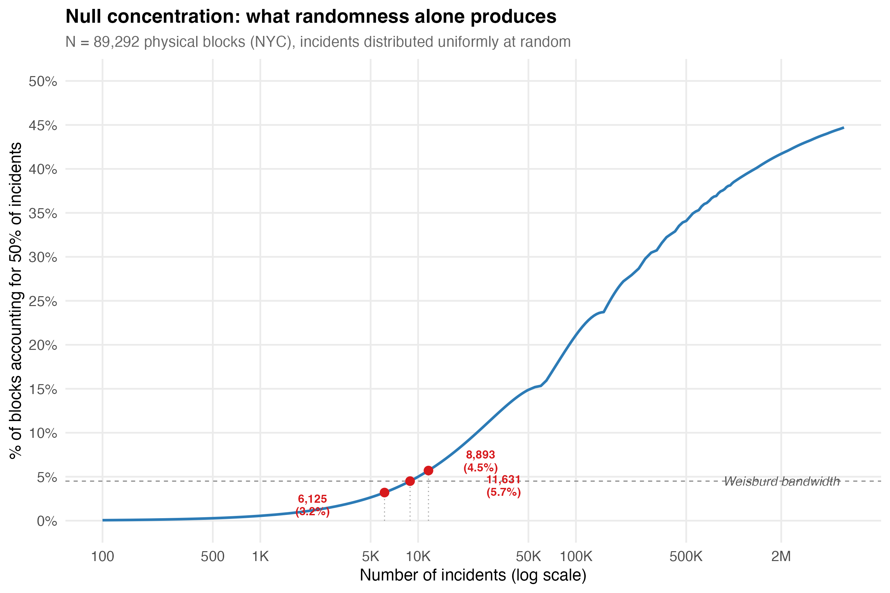

The curve establishes a threshold: any crime type producing fewer than approximately 6,000–12,000 incidents citywide will fall within the Weisburd bandwidth (3.2–5.7%) under pure randomness. For homicides (~8,200 incidents over 20 years), transit pickpocketing (~6,200), and several other categories, the conventional 50-X conveys little information about genuine spatial processes. The number lands inside the "law" range even under a uniformly random allocation.

### The Metric Wars and Their Resolution

The sparse-data problem generated a secondary debate about whether the "law" was robust at all. Hipp and Kim (2017) used an inverted metric — the 5-X, measuring what proportion of crime falls in the top 5% of segments — and reported bandwidths of 15–90%, far wider than Weisburd's 4–6%. The apparent contradiction fuelled scepticism about the law's generality.

Andresen and Weisburd (2025) resolved the dispute by comparing seven different concentration metrics across Vancouver crime data and showed that the disagreement is almost entirely about measurement, not substance. The 50-X and 5-X ask different questions — "how many places hold 50% of crime?" versus "how much crime sits in the top 5% of places?" — and the inversion of the ratio produces opposite sensitivity profiles. Small changes in concentration produce modest shifts in the 50-X but large swings in the 5-X. Converting Hipp and Kim's 5-X estimates back to 50-X equivalents restores the narrow bandwidth. The researchers were not disagreeing about the facts; they were using different lenses.

The more consequential finding was that the original 50-X is itself biased upward when the number of crimes is smaller than the number of spatial units — the default condition for serious crime. Andresen and Weisburd proposed a *generalized 50-X* that uses min(*n*, *N*) as the denominator — the maximum possible dispersion — rather than the total number of places. When crimes outnumber places, the generalized metric equals the standard 50-X. When crimes are rare relative to places, the correction is substantial: for theft of vehicle in Vancouver (626 crimes, 13,102 streets), the standard 50-X reads 1.9%, while the generalized 50-X reads 39.8% — a twenty-fold difference reflecting the mechanical inflation that the standard metric conceals.

The generalized 50-X maintains the interpretability that makes the 50-X useful for policy ("50% of crime is found at X% of places") while correcting the bias that makes it misleading for rare crimes. Our marginal concentration framework and the generalized 50-X address the same underlying problem from different angles: the marginal measures how much observed concentration exceeds chance; the generalized 50-X rescales the denominator to reflect the maximum feasible spread. Both converge on the same conclusion — for common crimes, concentration is genuine and large; for rare crimes, most apparent concentration is arithmetic.

---

## IV. What Our Data Show

### Concentration by Crime Type

We applied the marginal framework to 18 crime types and subtypes on NYC's 89,292 physical blocks, spanning the full volume spectrum from grand larceny (880,000 incidents) to transit pickpocketing (6,200).

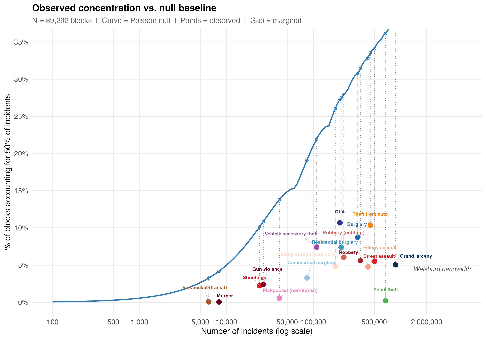

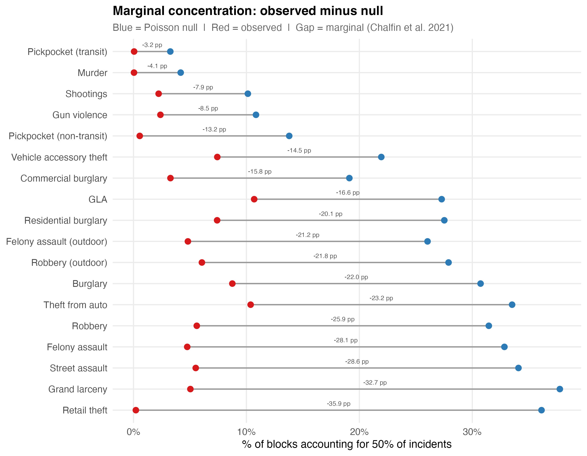

The hierarchy that emerges differs from the one the conventional metric produces. Under the standard 50-X, murder appears to be the most concentrated crime type (less than 0.1% of blocks). Under the marginal framework, murder has the *weakest* genuine concentration — a marginal of only -4.1 percentage points — because nearly all its apparent concentration is artifact. Retail theft shows the strongest genuine concentration: a marginal of -35.9 pp, meaning observed concentration exceeds the random baseline by 36 percentage points. The marginal framework does not merely adjust the values. It reorders the ranking.

The full results for selected types:

| Crime Type | Incidents | Observed 50-X | Null 50-X | Marginal (pp) | Marginal Gini |
|:-----------|----------:|:-------------:|:---------:|:-------------:|:-------------:|
| Retail theft | 675,073 | 0.2% | 36.1% | -35.9 | +0.781 |
| Grand larceny | 880,025 | 5.0% | 37.8% | -32.7 | +0.626 |
| Felony assault | 423,237 | 4.8% | 32.8% | -28.1 | +0.562 |
| Robbery | 346,591 | 5.6% | 31.5% | -25.9 | +0.524 |
| Outdoor robbery | 223,405 | 6.0% | 27.7% | -21.7 | +0.453 |
| Shootings | 23,988 | 2.2% | 10.1% | -7.9 | +0.140 |
| Gun violence | 26,519 | 2.4% | 10.8% | -8.4 | +0.153 |
| Murder | 8,192 | <0.1% | 4.0% | -3.9 | +0.069 |

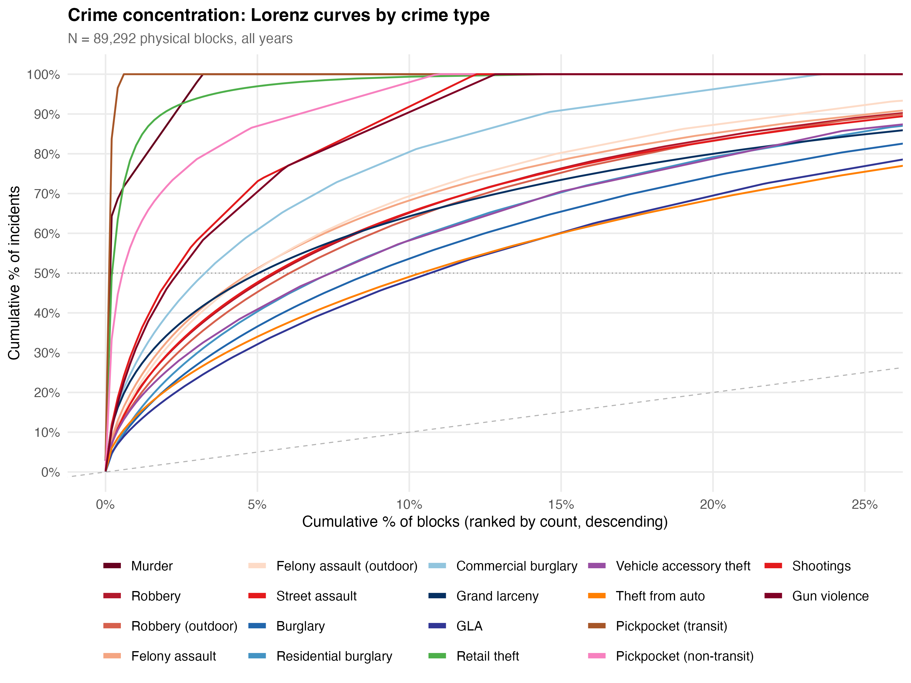

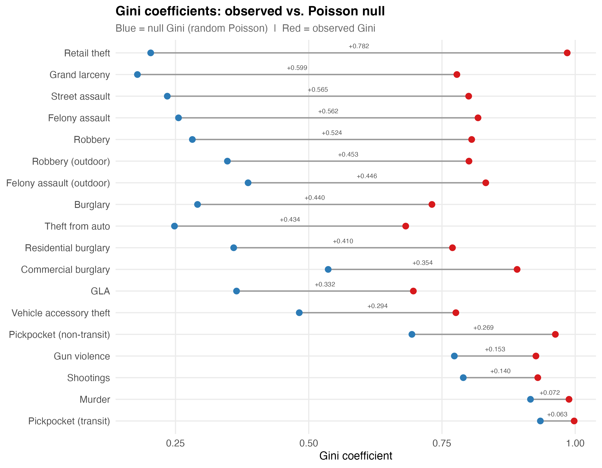

The Gini comparison makes the point starkly. Observed Gini coefficients exceed 0.95 for nearly every crime type — they all appear concentrated. But the null Gini is also extremely high for sparse types. The marginal Gini — the gap between observed and null — ranges from +0.781 (retail theft) to +0.069 (murder). A ten-fold range in genuine concentration, invisible under standard metrics.

### The 50-X Bandwidth in NYC

Within a single city, the observed 50-X for specific crime types ranges from less than 0.1% (murder) to 10.7% (theft from auto). For the 7 Major Felonies aggregate, the 50-X holds at 5.4–6.1% across all 19 years — within the Weisburd bandwidth. But disaggregate, and the range explodes.

The tightness of the canonical 3.2–5.7% bandwidth reflects several forces that compress the number:

**Sparse data.** For rare crimes, the 50-X falls inside the bandwidth regardless of the spatial distribution, because randomness alone produces those values. Including rare crime types in cross-study comparisons tightens the bandwidth mechanically.

**Aggregation.** Most studies use aggregate crime indices. Aggregating crime types with imperfectly correlated spatial distributions compresses concentration metrics toward a narrow range through portfolio diversification, volume dominance, and zero-inflation reduction.

**Metric choice.** Andresen and Weisburd (2025) showed that some apparent disagreement about the bandwidth is attributable to metric selection. The inverted 5-X metric produces wider bandwidths; converting all estimates to the 50-X form restores narrower ranges. But this is a statement about the metric, not about the phenomenon.

### Borough Heterogeneity

Citywide metrics average over geographically heterogeneous sub-areas. When we decompose marginal concentration by borough:

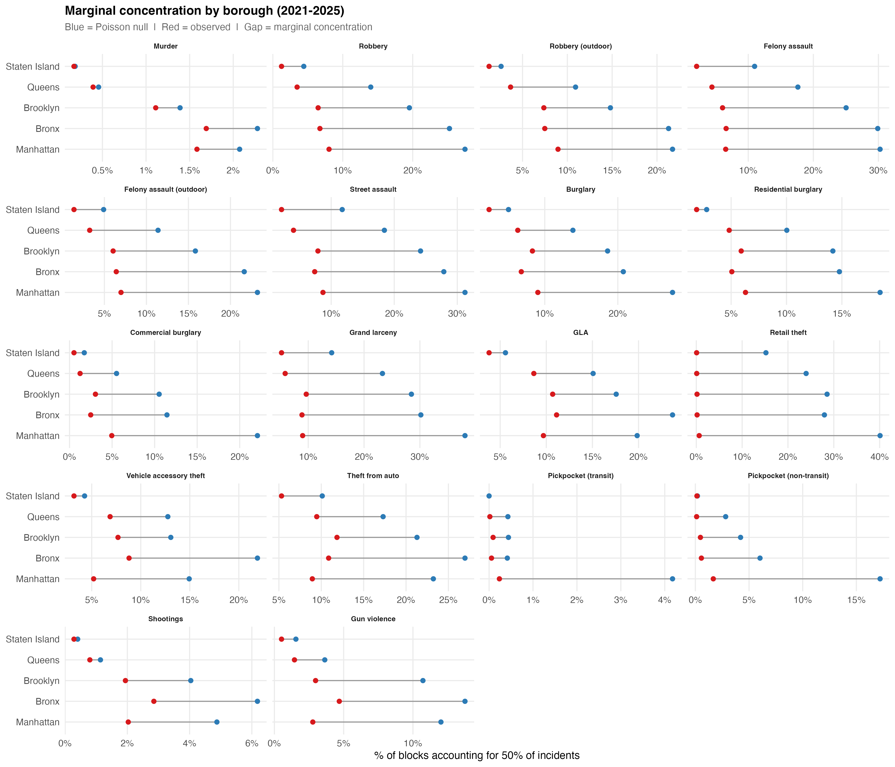

Manhattan leads for retail theft (-39.5 pp marginal, driven by λ = 15.4 — the largest single value in the entire analysis). The Bronx leads for shootings (-3.3 pp). Queens and Staten Island show near-zero shooting marginals — their apparent concentration is almost entirely sparsity artifact. Transit pickpocketing is essentially a Manhattan phenomenon.

O'Brien, Ciomek, and Tucker (2022) demonstrated an analogous result in Boston: two neighbourhoods with identical crime rates can have very different concentration profiles. Concentration is not a property of the city as a whole. It is a property of specific places within specific parts of the city, for specific crime types.

---

## V. Concentration Over Time: Trajectories and Temporal Stability

### Trajectory Groups

The concentration finding tells you where crime is. It does not tell you whether those places stay hot, cool down, or heat up. Trajectory analysis addresses this gap.

K-means clustering on log-transformed annual counts across 89,292 physical blocks over 19 years (2006–2024) identified seven trajectory groups for 7 Major Felonies. The always-zero blocks were separated deterministically before clustering; k=6 non-zero groups were selected based on literature precedent (Weisburd et al. typically find 6–8 groups), elbow analysis, and GBTM cross-validation on a 2,000-block subsample.

| Group | Label | N Blocks | % of Blocks | % of Crime | Mean Annual Count |
|:-----:|:------|:--------:|:-----------:|:----------:|:-----------------:|
| 0 | Crime-free | 20,006 | 22.4% | 0.0% | 0.00 |
| 2 | Low-increasing | 28,546 | 32.0% | 5.4% | 0.21 |
| 6 | Low-moderate | 17,021 | 19.1% | 11.7% | 0.75 |
| 1 | Moderate | 11,317 | 12.7% | 17.0% | 1.65 |
| 4 | High | 7,189 | 8.1% | 21.1% | 3.23 |
| 5 | Very high | 4,088 | 4.6% | 24.1% | 6.49 |
| 3 | Chronic-high | 1,125 | 1.3% | 20.7% | 20.18 |

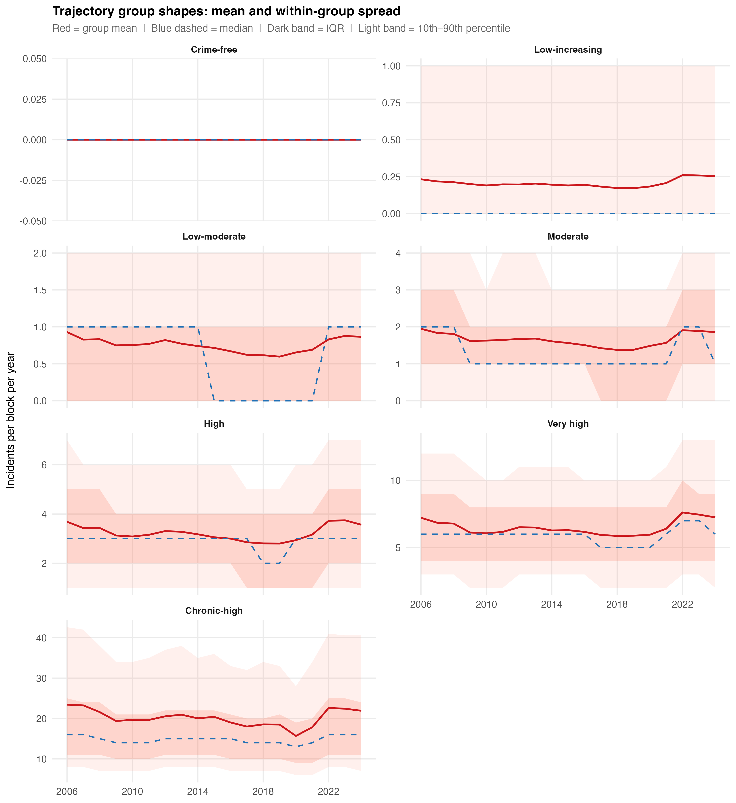

In plain operational terms: a crime-free block saw zero felonies over two decades. A low-increasing block averages one felony every five years. A moderate block sees one to two per year — enough to register but not enough to be flagged. A high block averages one every four months — a block with a bar, a housing project entrance, a busy commercial intersection. A chronic-high block sees a felony roughly every 18 days, sustained for 19 years. These are Times Square blocks, Penn Station blocks, the commercial corridors of Midtown and downtown Brooklyn.

The combined top three groups — high, very high, and chronic-high — account for 13.9% of blocks and 65.8% of all major felony crime over 19 years.

### Are the Groups Discrete or Continuous?

Trajectory groups are analytic constructs. A substantial methodological literature warns against reifying them as evidence of discrete place types (Skardhamar, 2010; Erosheva et al., 2014). The question is whether k-means found real separations in the data or imposed arbitrary cuts on a continuous distribution.

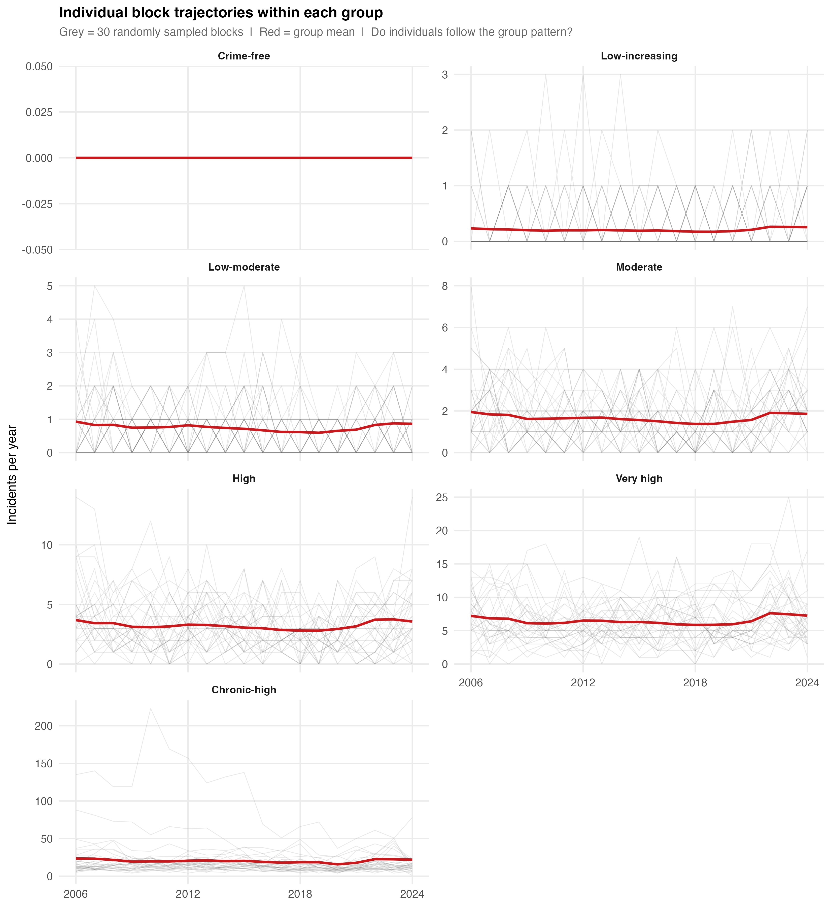

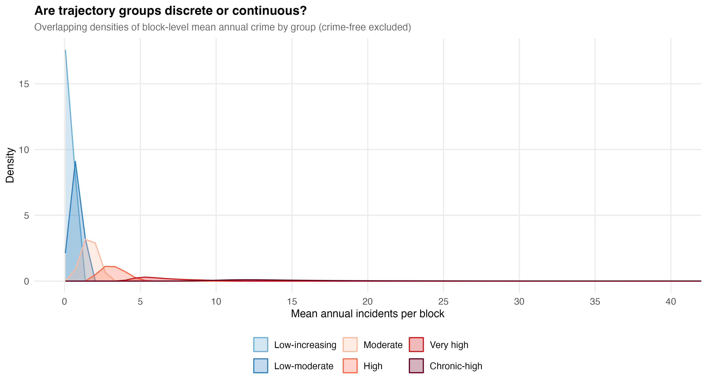

The diagnostics yield a split verdict. The lower five groups — crime-free through high — are surprisingly discrete. Less than 1% of blocks in any group have a mean annual crime rate exceeding the median of the next group up. The within-group distributions are tight, roughly symmetric, and separated by visible gaps. K-means found real structure, not artifact.

The chronic-high group is a different story. Its within-group coefficient of variation is 0.96 — the standard deviation equals the mean. The range runs from 10 to 336 felonies per year. A block averaging 12 and a block averaging 200 occupy the same group. The spaghetti plot makes this unmistakable: individual trajectories diverge by a factor of 30×. This group is a catch-all for everything above the very-high threshold, not a coherent operational category. A higher k at the top of the distribution would almost certainly split it into subgroups with distinct profiles.

### Temporal Stability

The dominant finding across all groups is stability. Every group from crime-free through very high shows an essentially flat trajectory — no meaningful trend up or down across 19 years. The one exception is the low-increasing group (32% of blocks), which shows a modest upward drift. Whether this reflects genuine crime increase, improved reporting, or spatial spillover is an open question.

This replicates the core finding from Seattle (Weisburd et al., 2004), Vancouver (Curman et al., 2015), and Albany (Wheeler et al., 2016), though with a somewhat lower stability rate (68% vs. 70–84% in prior studies). The difference may reflect NYC's larger scale, greater heterogeneity, or the longer observation window.

The stability of concentration *parameters* is itself a key finding. The 50-X for 7 Major Felonies held at 5.4–6.1% across all 19 years. The Gini hovered between 0.80 and 0.82. The spatial pattern persists even as absolute crime counts change substantially.

### Concentration Is Not Static

When we track marginal concentration over time for specific crime types, a more dynamic picture emerges:

Retail theft concentration has been increasing steadily: the marginal 50-X roughly doubled from 2006 to the present, with the sharpest increase during 2020–2022 when volume surged while concentrating at the same commercial blocks. Robbery shows a different trajectory — stable but declining concentration. Shootings show negligible marginal concentration in any single year, never exceeding -0.2 pp.

The bandwidth is not consistent across time or geography within a city. It moves with the data-generating process. Concentration that is increasing for retail theft and declining for robbery reflects shifting opportunity structures. The law's emphasis on a stable bandwidth treats this variation as noise when it is signal.

### Spatial Heterogeneity Within Neighbourhoods

The micro-place thesis — articulated most forcefully in Groff, Weisburd, and Morris's (2009) "Where the Action Is" analysis and confirmed by O'Brien and Winship's (2017) Boston address-level study — holds that crime varies dramatically within neighbourhoods. Our data confirm this at the scale of NYC's 89,292 physical blocks: on average, 62.7% of a block's six nearest neighbours were in a different trajectory group. For chronic-high blocks, 77.7% of neighbours followed a different trajectory. Even the most consistently high-crime blocks in the city are typically surrounded by blocks with substantially different crime profiles.

Local Moran's I analysis found only 15,524 blocks (17.4%) in statistically significant spatial clusters. The remaining 82.6% are not spatially clustered with like-trajectory neighbours. At the physical block level, heterogeneity dominates over homogeneity.

The precinct-level trajectory distributions make this concrete:

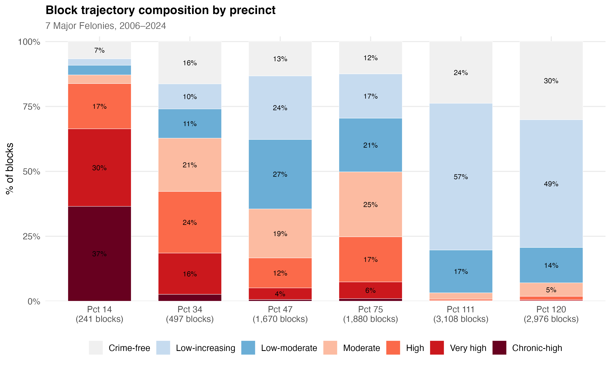

Precinct 14 (Midtown South) has 36.5% chronic-high blocks. Precinct 111 (Bayside) has one. Precinct 75 (East New York) — a precinct with a high overall crime rate — has only 1.0% chronic-high blocks alongside 12.4% crime-free blocks. The variation *within* high-crime precincts is as striking as the variation *between* them.

---

## VI. Why Concentration May Be Overdetermined

Even after correcting for sparse data, the genuine spatial signal in crime concentration may be less distinctively *about crime* than the field has generally assumed.

Eck, Lee, O, and Martinez (2017) posed the most consequential question: compared to what? They showed that crime concentrates at roughly the same level as hospital visits, traffic accidents, and code violations. The J-curve distribution that characterises crime concentration is common across spatial data generally.

Several non-criminological processes would produce concentrated spatial distributions independently:

1. **Network topology.** Some streets are topologically more integrated — requiring fewer direction changes to reach all other streets — and attract disproportionate pedestrian flow purely as a function of network structure (Hillier et al., 1993; Davies & Johnson, 2015).

2. **Superlinear scaling.** Social outputs — wages, patents, and crime — scale superlinearly with city population (Bettencourt et al., 2007). Crime concentration becomes a corollary of a general scaling relationship between social interaction and spatial density.

3. **Multiplicative accumulation.** When a quantity grows by random proportional increments, the resulting distribution is heavy-tailed regardless of any spatial clustering mechanism (Mitzenmacher, 2004). Crime accumulation at a block is plausibly multiplicative: each additional commercial establishment or transit connection multiplies opportunity rather than adding to it linearly.

4. **Economic agglomeration.** Commercial activity self-reinforces at specific locations, and crime opportunity follows.

Phillips (2022) formalised the implication as equifinality: the same distributional outcome can be produced by multiple distinct generative processes. A concentrated distribution is consistent with routine activities, social disorganisation, network centrality, and pure stochastic accumulation simultaneously. The distribution alone cannot identify the mechanism.

The marginal concentration framework strips away the occupancy problem. But the remaining signal may reflect criminological processes, urban geometry, or both. For intervention design, the distinction matters less than the stability of the pattern — and the pattern is stable.

---

## VII. Crime Types Are Not the Same Phenomenon

### The Aggregation Problem

"Crime" is not a natural kind. It is an administrative category that bundles together behaviours with nothing in common except that the state has decided to prohibit them. Robbery is driven by economic desperation and opportunity structure. Domestic assault is driven by relationship dynamics. Auto theft is driven by resale markets and anti-theft technology. A "crime rate" that sums them is a number that no single intervention can move coherently.

This matters directly for concentration and resource allocation. A block that concentrates retail theft calls for situational prevention and environmental design. A block with shootings calls for violence interruption and social service coordination. A block with both needs both. The aggregate count does not distinguish between them, yet the response to each is fundamentally different.

### The Portfolio Effect

When multiple crime types with imperfectly correlated spatial distributions are summed, concentration metrics compress toward a narrow bandwidth. Combining spatially uncorrelated types reduces "concentration risk," much as diversifying a financial portfolio reduces variance. A block that is a hot spot for robbery but not burglary will appear less concentrated in a combined index than in either type alone. High-count types dominate rare types in the aggregate. And summing types fills in zero-crime blocks, pushing the distribution toward a less extreme shape.

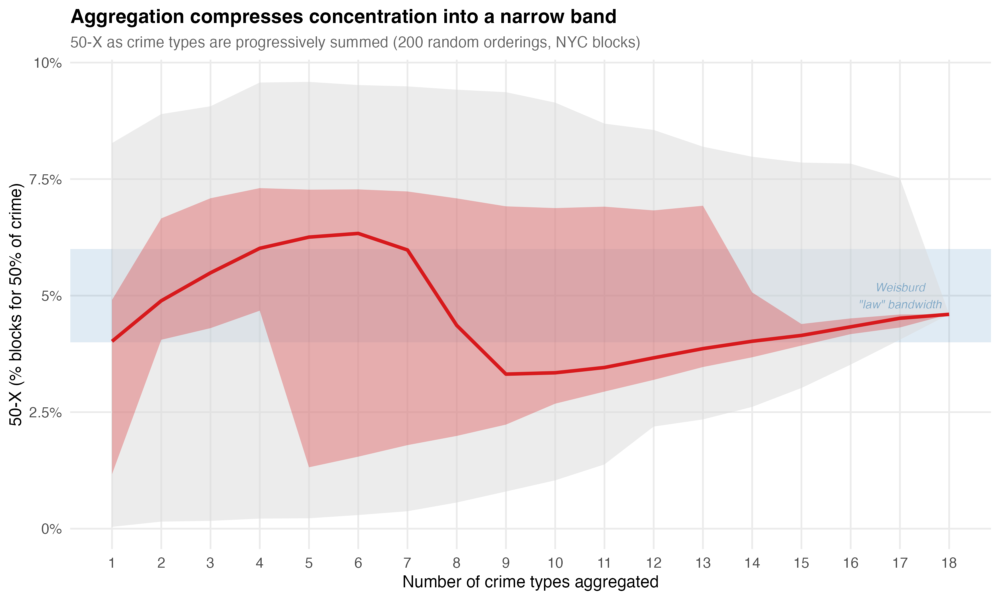

The tight 4–6% bandwidth may be partly a property of aggregation — a mathematical attractor as much as a substantive spatial regularity.

### Overlapping But Not Identical Opportunity Structures

Our cross-type concordance analysis for NYC confirms partial but imperfect overlap across crime types:

Of the 1,125 blocks in the chronic-high trajectory for 7 Major Felonies, 53% were also in the highest robbery group and 64% in the highest larceny group. But the correspondence is not one-to-one. The chronic hot spots are driven by a mix of crime types, and the mix varies from block to block. The "worst" blocks for robbery are not the "worst" blocks for retail theft.

### Aggregation for Explanation vs. Aggregation for Allocation

The critique of aggregation requires a distinction. Aggregation is incoherent *for explanation*: you cannot build a causal model of "total crime" because there is no single generating process. But aggregation is practically necessary *for allocation*: a city budget must make tradeoffs, and some common metric is preferable to treating every line item as incomparable.

Epidemiology provides the parallel. The DALY (disability-adjusted life year) aggregates across conditions — malaria, depression, road injuries — that have completely different aetiologies. No one treats "total DALYs" as a single phenomenon. But the framework is useful for resource allocation because a health ministry must distribute a finite budget across incommensurable problems (Murray & Lopez, 1996). The Cambridge Crime Harm Index (Sherman et al., 2016) operates on the same logic. The claim is not that weighted crime is a natural kind; the claim is that it provides a rational basis for prioritisation.

The position advanced here is not to reject aggregation but to practise *transparent legibility* — aggregates that do not conceal what they are collapsing. The policy conversation should begin with the aggregate but immediately ask *which* crimes, *where*, driven by *what*.

---

## VIII. What This Means for Every Block Counts

Return to the three conditions.

**Persistence.** The trajectory analysis confirms it. The majority of NYC blocks maintain stable crime levels over 19 years, and the chronic-high group has been persistently elevated throughout. The 22.4% of blocks with zero major felonies across the entire period are persistently safe. The pattern is stable enough to target.

**Concentration.** It is real but requires careful interpretation. The marginal framework shows that genuine spatial concentration is predominantly a property-crime phenomenon. For shootings and homicides — the crimes that carry the most harm and that Every Block Counts most needs to affect — the marginal concentration is modest. This does not mean place-based intervention is futile for violence. It means the efficiency gain is smaller than the conventional 50-X metric suggests, and that the target set is less stable year-to-year. The trial design must account for this: the matched-pair cluster RCT needs sufficient harm at treated blocks to detect an effect, and diffuse harm can render a sound strategy invisible to the evaluation.

**The type-specificity problem.** If the intervention treats "crime" as a single phenomenon, it will allocate resources based on an aggregate that obscures the distinct generating processes at each block. The trial should measure type-specific effects, not only total-crime effects, because the aggregate can mask success on one dimension while a different dimension holds steady.

Concentration metrics typically count incidents. A pickpocketing and a homicide each count once. This is inadequate for resource allocation, and the Cambridge Crime Harm Index (Sherman et al., 2016) was developed to address it — weighting crimes by sentencing severity to produce a metric that reflects the harm a community actually experiences.

The harm-weighted framework changes the concentration picture. Homicide is rare and weakly concentrated in the marginal sense, but its harm per incident is orders of magnitude greater than theft. A block with one murder imposes more harm than a block with 50 larcenies. When the question shifts from "where does crime happen most" to "where does harm concentrate most," the answer may differ — and the answer matters more for intervention design. For Every Block Counts, the relevant question is not "what percentage of blocks account for 50% of incidents" but "what percentage of blocks account for 50% of harm."

The concentration finding provides the warrant for place-based intervention. The measurement critique does not undermine that warrant; it refines it. Crime concentrates at micro-places, but the concentration varies by type, by time, and by geography. The genuine signal is strongest for property crime and weakest for the violent crime that matters most for public safety. The policy response should match the precision of the measurement: disaggregated, harm-weighted, and temporally dynamic.

The next chapter takes up the harm question directly.

---

## References

Andresen, M. A. (2006). Crime measures and the spatial analysis of criminal activity. *British Journal of Criminology*, 46(2), 258–285.

Andresen, M. A., Curman, A. S., & Linning, S. J. (2017). The trajectories of crime at places. *Journal of Quantitative Criminology*, 33(3), 427–449.

Andresen, M. A. & Weisburd, D. (2025). Ockham's razor and the measurement of crime concentrations. *Journal of Quantitative Criminology*, 41, 1–25.

Bernasco, W. & Steenbeek, W. (2017). More places than crimes. *Journal of Quantitative Criminology*, 33(3), 451–467.

Bettencourt, L. M. A. (2013). The origins of scaling in cities. *Science*, 340(6139), 1438–1441.

Bettencourt, L. M. A., Lobo, J., Helbing, D., Kuhnert, C., & West, G. B. (2007). Growth, innovation, scaling, and the pace of life in cities. *PNAS*, 104(17), 7301–7306.

Brantingham, P. J. & Brantingham, P. L. (1993). Environment, routine, and situation. In R. V. Clarke & M. Felson (Eds.), *Routine Activity and Rational Choice*. Transaction Publishers.

Chalfin, A., Kaplan, J., & Cuellar, M. (2021). Measuring marginal crime concentration. *Journal of Research in Crime and Delinquency*, 58(4), 467–504.

Clarke, R. V. (1995). Situational crime prevention. *Crime and Justice*, 19, 91–150.

Cohen, L. E. & Felson, M. (1979). Social change and crime rate trends. *American Sociological Review*, 44(4), 588–608.

Cornish, D. B. & Clarke, R. V. (1986). *The Reasoning Criminal*. Springer-Verlag.

Curman, A. S. N., Andresen, M. A., & Brantingham, P. J. (2015). Crime and place: A longitudinal examination of street segment patterns in Vancouver, BC. *Journal of Quantitative Criminology*, 31(1), 127–147.

Davies, T. & Johnson, S. D. (2015). Examining the relationship between road structure and burglary risk. *Journal of Quantitative Criminology*, 31, 481–507.

Eck, J. E., Lee, Y., O, S., & Martinez, N. N. (2017). Compared to what? *Crime Science*, 6, 8.

Erosheva, E. A., Matsueda, R. L., & Telesca, D. (2014). Breaking bad: Two decades of life-course data analysis. *Annual Review of Statistics and Its Application*, 1, 301–332.

Hillier, B., Penn, A., Hanson, J., Grajewski, T., & Xu, J. (1993). Natural movement. *Environment and Planning B*, 20(1), 29–66.

Mitzenmacher, M. (2004). A brief history of generative models for power law and lognormal distributions. *Internet Mathematics*, 1(2), 226–251.

Mohler, G., Brantingham, P. J., Carter, J., & Short, M. B. (2019). Reducing bias in estimates for the law of crime concentration. *Journal of Quantitative Criminology*, 35, 747–765.

Murray, C. J. L. & Lopez, A. D. (1996). *The Global Burden of Disease*. Harvard School of Public Health/WHO/World Bank.

O'Brien, D. T., Ciomek, A., & Tucker, R. (2022). Crime concentration variation across neighborhoods. *Journal of Quantitative Criminology*, 38, 775–800.

Phillips, J. D. (2022). The law of scale independence. *Annals of GIS*, 28(1), 15–29.

Quetelet, A. (1842). *A Treatise on Man and the Development of His Faculties*. Edinburgh: Chambers.

Shaw, C. R. & McKay, H. D. (1942). *Juvenile Delinquency and Urban Areas*. University of Chicago Press.

Sherman, L. W., Gartin, P. R., & Buerger, M. E. (1989). Hot spots of predatory crime. *Criminology*, 27(1), 27–56.

Sherman, L. W., Neyroud, P. W., & Neyroud, E. (2016). The Cambridge Crime Harm Index. *Policing*, 10(3), 171–183.

Skardhamar, T. (2010). Distinguishing facts and artifacts in group-based modeling. *Criminology*, 48(1), 295–320.

Spencer, M. D. & Schnell, C. (2022). Reinvestigating cities and the spatial distribution of robbery. *Journal of Criminal Justice*, 82, 101988.

Walter, R. J., Tillyer, M. S., & Acolin, A. (2023). Spatiotemporal crime patterns across six U.S. cities. *Journal of Quantitative Criminology*, 39, 983–1011.

Weisburd, D. (2015). The law of crime concentration and the criminology of place. *Criminology*, 53(2), 133–157.

Weisburd, D., Bushway, S., Lum, C., & Yang, S. (2004). Trajectories of crime at places. *Criminology*, 42(2), 283–322.

Weisburd, D., Zastrowa, T., Kuen, K., & Andresen, M. A. (2024). Crime concentrations at micro places: A review of the evidence. *Aggression and Violent Behavior*, 78, 101936.

Weisburd, D., Bernasco, W., & Bruinsma, G. J. N. (Eds.). (2009). *Putting Crime in its Place: Units of Analysis in Geographic Criminology*. Springer.

Wheeler, A. P., Worden, R. E., & McLean, S. J. (2016). Replicating group-based trajectory models of crime at micro-places in Albany, NY. *Journal of Quantitative Criminology*, 32(4), 589–612.

Cornish, D. B. & Clarke, R. V. (1986). *The Reasoning Criminal: Rational Choice Perspectives on Offending*. Springer-Verlag.

Groff, E. R., Weisburd, D., & Morris, N. A. (2009). Where the action is at places: Examining spatio-temporal patterns of juvenile crime at places using trajectory analysis and GIS. In D. Weisburd, W. Bernasco, & G. J. N. Bruinsma (Eds.), *Putting Crime in its Place* (pp. 61–86). Springer.

Hipp, J. R. & Kim, Y.-A. (2017). Measuring crime concentration across cities of varying sizes. *Journal of Quantitative Criminology*, 33(3), 595–632.

O'Brien, D. T. & Winship, C. (2017). The gains of greater granularity: The presence and persistence of problem properties in urban neighborhoods. *Journal of Quantitative Criminology*, 33, 649–675.
