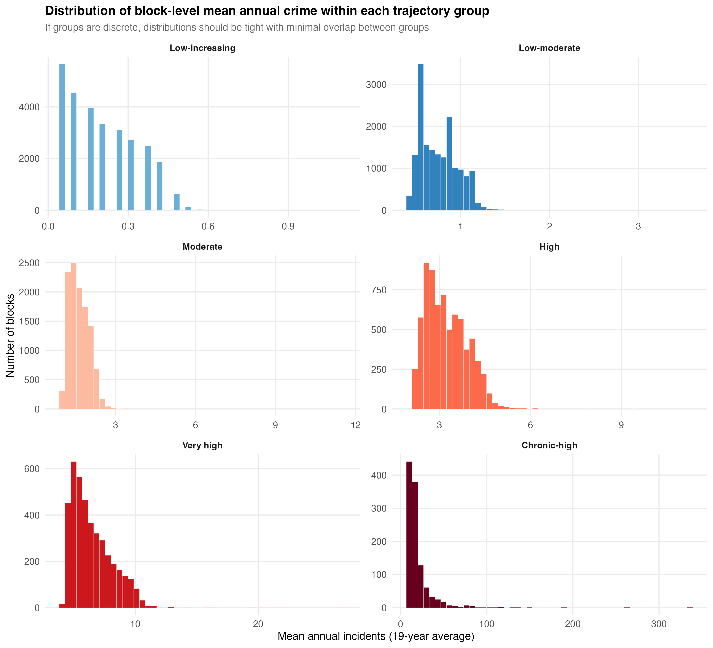
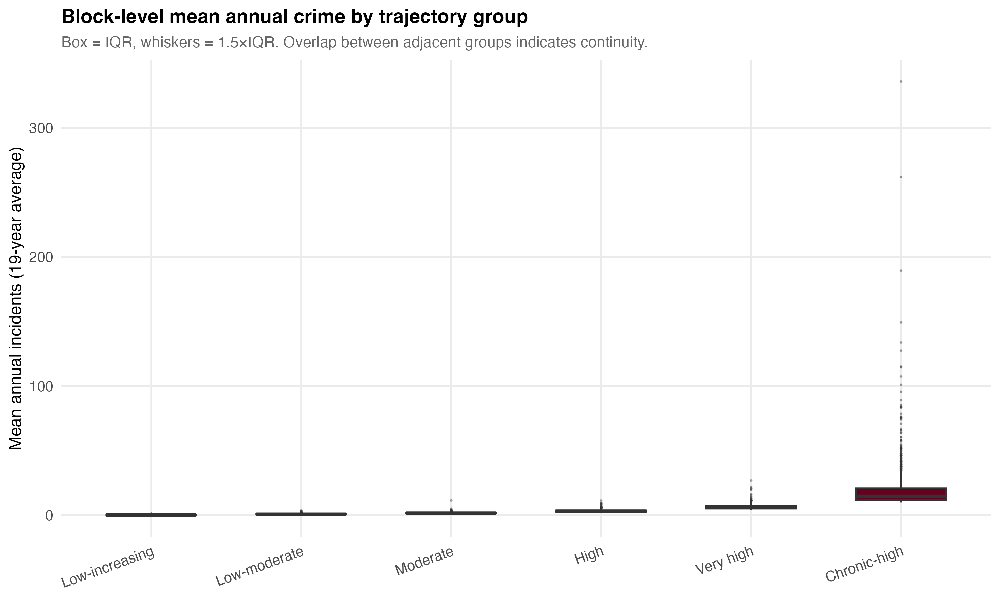

# What the Trajectory Groups Actually Mean

## The Setup

K-means clustering on 19 years of annual crime counts (log-transformed) across 89,292 physical blocks produced seven trajectory groups for 7 Major Felonies. Six come from the algorithm; the seventh — crime-free — was separated deterministically before clustering.

The question this document answers: What do these groups look like in practice? And are they genuinely discrete categories, or are they arbitrary cuts in a continuous distribution?

---

## Why Six Groups (Plus Crime-Free)?

The choice of k=6 non-zero groups rests on three legs:

**1. Literature precedent.** Weisburd et al. (2004) found 6–8 trajectory groups for street segments in Seattle. Curman et al. (2015) found a similar range in Vancouver. The trajectory literature consistently recovers this number of groups for crime at micro-places. Starting with k=6 keeps results comparable.

**2. Elbow analysis.** The script evaluated k=2 through k=12 on within-cluster sum of squares (WSS). The marginal WSS reduction — how much each additional group improves the fit — flattens around k=5 to k=7. Below k=5, groups are too coarse (the "high" and "chronic" blocks get lumped together). Above k=8, additional groups subdivide the middle of the distribution without adding interpretive value.

**3. The Calinski-Harabasz index was unreliable.** For zero-inflated count data, the CH index is biased toward k=2 — it always "prefers" splitting the data into zero and nonzero. This is mathematically correct (the zero/nonzero split is the single largest source of variance) but substantively useless. The always-zero blocks were separated before clustering precisely because of this problem. With zero-inflation handled, the CH index becomes unstable across k values.

**4. GBTM validation.** A zero-inflated Poisson GBTM (via `crimCV`) was estimated on a 2,000-block subsample with 6 groups. Cross-tabulation confirmed structural concordance: each GBTM group mapped systematically to 1–2 k-means groups, validating that the trajectory structure is not an artifact of the clustering method.

**What k=6 does not tell you:** The number of groups is a modeling choice, not a property of the data. The data do not contain six discrete types of places. They contain a continuous distribution of crime rates that k-means partitions into six segments. The question is whether those segments are useful — whether they capture meaningful operational distinctions. The diagnostics below address this directly.

---

## The Seven Groups, in Plain Language

### Group 0: Crime-free (20,006 blocks — 22.4%)

Zero major felonies across all 19 years. Not one incident from 2006 to 2024. These blocks are invisible in the concentration literature because most studies focus on where crime is, not where it isn't. But they are the single largest group — nearly one in four blocks in the city.

**What this looks like:** Residential side streets in eastern Queens, Staten Island's south shore, parts of Bayside and Tottenville. Blocks where a felony never happened in two decades.

**Mean annual crime:** 0.00 (by definition).

---

### Group 2: Low-increasing (28,546 blocks — 32.0%)

The largest non-zero group. These blocks average about 0.2 incidents per year — roughly one felony every five years. The "increasing" label comes from a modest upward trend: the group's mean drifts from near zero early in the period to slightly above zero later. In practice, these are blocks where crime is rare and sporadic.

**What this looks like:** A residential block that might see a grand larceny in 2011, nothing for four years, then a burglary in 2016 and an assault in 2022. No sustained pattern — just occasional events.

**Mean annual crime:** 0.21 (median: 0.21). IQR: 0.11 to 0.32.

The within-group distribution is right-skewed but compressed. The range runs from 0.05 to 1.1, meaning even the "worst" block in this group averages barely one incident per year. The trajectory shape panel shows a flat line hugging zero with the 10th–90th percentile band barely visible.

---

### Group 6: Low-moderate (17,021 blocks — 19.1%)

These blocks average about 0.75 incidents per year — roughly one felony every 15 months. Stable over time. The trajectory is flat: no meaningful trend up or down across the 19 years.

**What this looks like:** A block with a consistent low hum of crime. One or two incidents most years. The kind of block where a precinct commander would not flag it as a problem, but it is not crime-free either.

**Mean annual crime:** 0.75 (median: 0.74). IQR: 0.58 to 0.90.

Tight within-group spread. The distribution is roughly symmetric around the mean with a slight right tail. The coefficient of variation (CV) is 0.28 — the second-tightest of all groups.

---

### Group 1: Moderate (11,317 blocks — 12.7%)

About 1.6 felonies per year, or roughly 30 over the 19-year span. Stable trajectory — the group mean barely moves from 2006 to 2024.

**What this looks like:** A block that reliably produces one to two incidents per year. Enough to show up on a precinct-level analysis but not enough to be called a hot spot. These blocks collectively account for 17% of all major felony crime — a substantial share from a group that does not attract attention.

**Mean annual crime:** 1.65 (median: 1.58). IQR: 1.37 to 1.90.

Tight. CV = 0.23. Most blocks in this group are genuinely similar to each other. A few outliers reach 10+ (blocks that might have been classified higher with a different random seed in k-means), but the core mass is concentrated between 1 and 2.

---

### Group 4: High (7,189 blocks — 8.1%)

About 3.2 felonies per year — roughly one every four months. Stable over time. These blocks account for 21.1% of all major felony crime despite being only 8% of blocks.

**What this looks like:** A commercial corridor block, a busy intersection, a block with a bar or a housing project entrance. Crime is not constant, but it is consistent. Three or four incidents per year, year after year.

**Mean annual crime:** 3.23 (median: 3.10). IQR: 2.68 to 3.74.

The distribution is symmetric and tight (CV = 0.22). This is one of the most internally coherent groups. The range is 2.0 to 11.3 — upper outliers exist but the bulk is packed between 2 and 4.

---

### Group 5: Very high (4,088 blocks — 4.6%)

About 6.5 felonies per year — more than one every two months. These blocks produce 24.1% of all major felony crime. If you combine this group with the chronic-high group below, 5.9% of blocks generate 44.8% of crime.

**What this looks like:** High-foot-traffic commercial blocks, transit hub surroundings, public housing complexes. Crime is a regular feature of the block's daily life. Six or seven incidents per year is the norm.

**Mean annual crime:** 6.49 (median: 6.05). IQR: 5.16 to 7.47.

Moderate spread. CV = 0.26. The distribution is right-skewed — most blocks cluster between 4 and 8, with a tail extending to 27. The right tail represents blocks that could arguably be classified as chronic-high but landed here because of their temporal shape rather than their absolute level.

The trajectory shape panel shows within-group variation becoming visible here: the 10th–90th percentile band spans roughly 3 to 12, meaning the "very high" label covers a wide operational range. A block averaging 4 felonies per year and a block averaging 12 are both in this group.

---

### Group 3: Chronic-high (1,125 blocks — 1.3%)

The extreme tail. These blocks average 20.2 felonies per year — roughly one every 18 days for two decades straight. They account for 20.7% of all major felony crime.

**What this looks like:** Times Square. Penn Station blocks. The blocks surrounding Herald Square, Union Square, major transit hubs, and the busiest commercial corridors in Manhattan. A handful of blocks in downtown Brooklyn, the Hub in the Bronx, and Jamaica Center in Queens. These are the blocks where multiple felonies per week is the sustained reality.

**Mean annual crime:** 20.2 (median: 14.6). IQR: 11.8 to 20.8.

This is the one group that is clearly **not internally coherent**. The mean is 20, the median is 15, and the maximum is 336. The CV is 0.96 — nearly 1.0 — meaning the standard deviation is as large as the mean. The within-group distribution has a massive right tail: most blocks are between 10 and 25, but a few are in the hundreds.

The spaghetti plot makes this vivid. Individual block trajectories in the chronic-high group diverge wildly. Some are flat at 15 per year; one is at 200. The group mean (red line) tracks around 20, but most individual blocks are below it. The mean is dragged up by extreme outliers.

**This group is doing double duty.** It contains both genuinely chronic blocks (consistently 10–20 per year) and extreme commercial/transit outliers (50–300+ per year) that have no peer group because k=6 does not provide enough resolution at the top of the distribution. A k=8 or k=10 solution would almost certainly split this group into "chronic" and "extreme" subsets.

---

## Are the Groups Discrete or Continuous?

This is the critical methodological question. The answer depends on where you look in the distribution.

### The lower five groups: Surprisingly discrete

The overlap analysis reveals almost no bleed between adjacent groups:

| Adjacent groups | % of lower group above upper group's median |
|:----------------|:---:|
| Low-increasing → Low-moderate | 0.0% |
| Low-moderate → Moderate | 0.1% |
| Moderate → High | 0.2% |
| High → Very high | 0.2% |

Less than 1% of blocks in any group have a mean annual crime rate above the median of the next group up. The groups occupy distinct bands on the crime-rate axis with minimal overlap. The within-group distributions (histograms) confirm this: each group's distribution is compact, roughly symmetric, and separated from its neighbors by a visible gap.

This is a stronger result than the GBTM critique literature (Skardhamar 2010, Erosheva et al. 2014) would predict. Those papers showed that mixture models often recover "groups" from continuous data. Here, k-means — which makes no distributional assumptions — produces groups that are genuinely separated in the crime-rate space. The log transformation likely helps: by compressing the scale, k-means distinguishes shapes and levels rather than just being pulled by outliers.

**The overlapping density plot is misleading at first glance.** Because the lower groups contain so many more blocks (28,546 in low-increasing vs. 4,088 in very high), their densities dominate the plot visually. But look at the x-axis positions — the group peaks are at 0.2, 0.7, 1.6, 3.2, and 6.5. These are cleanly separated. The apparent "overlap" in the density plot is mostly a visual artifact of differing group sizes and right-skew within each group.

### The chronic-high group: Continuous

The chronic-high group is a different story. Its within-group distribution is:

- Range: 9.9 to 336
- IQR: 11.8 to 20.8
- CV: 0.96

This is not a discrete group. It is a catch-all for everything above the very-high threshold. A block averaging 10 felonies per year and a block averaging 336 are fundamentally different operational realities, yet k-means assigns them to the same group because there are not enough clusters to subdivide the tail.

The spaghetti plot makes this unmistakable: individual trajectories in the chronic-high group span a factor of 30×. The group mean (red line at ~20) is not representative of most blocks in the group, which cluster around 10–15. A few extreme outliers pull the mean up. This is exactly the within-group heterogeneity that Erosheva et al. (2014) warned about.

### The Very high → Chronic-high boundary: The weakest cut

The transition from very high (mean 6.5, range 4–27) to chronic-high (mean 20.2, range 10–336) is the least clean boundary. The upper tail of very high (blocks averaging 15–27) overlaps with the lower portion of chronic-high (blocks averaging 10–15). This boundary is an artifact of the k=6 specification, not a natural break in the data.

### Bottom line

| Region of distribution | Assessment |
|:-----------------------|:-----------|
| Crime-free | **Perfectly discrete** — binary (0 vs. >0), no ambiguity |
| Low-increasing through High (Groups 2, 6, 1, 4) | **Surprisingly discrete** — tight within-group distributions, <1% overlap between adjacent groups, cleanly separated peaks |
| High to Very high (Groups 4 → 5) | **Mostly discrete** — some overlap in the tails but core distributions are separated |
| Very high to Chronic-high (Groups 5 → 3) | **Continuous** — the boundary is a k-means artifact; the chronic-high group contains blocks spanning an order of magnitude |
| Within Chronic-high (Group 3) | **Clearly continuous** — CV ≈ 1.0, massive right tail, group mean not representative of most members |

---

## What the Trajectory Shapes Tell You

The faceted trajectory panel shows each group's mean (red line), median (blue dashed), and within-group spread (IQR as dark band, 10th–90th as light band) over time.

**Stability dominates.** For every group from crime-free through very high, the trajectory is essentially flat. The mean annual crime rate does not change meaningfully from 2006 to 2024. This is the core replication of Weisburd et al. (2004): most places maintain their crime level over time.

**The one exception is "low-increasing."** This group shows a visible upward drift — the mean and median both rise from near zero in 2006 to about 0.3–0.4 by 2024. Whether this reflects a genuine increase in crime at these blocks, improved reporting, or spatial spillover from adjacent areas is an open question.

**The median diverges from the mean for chronic-high and very high.** In the chronic-high group, the median (blue dashed) sits around 15 while the mean (red) is at 20. The gap is outlier-driven. The median is a better summary of a "typical" chronic-high block.

**Within-group variation increases with crime level.** For low-increasing blocks, the IQR band is barely visible (all blocks are near zero). For chronic-high blocks, the 10th–90th band spans from about 5 to 40 — an 8× range. The spaghetti plots confirm this: individual trajectories in the lower groups track each other closely; in the upper groups, they diverge.

---

## Implications

1. **The lower groups are real.** For operational purposes, the distinction between crime-free, low-increasing, low-moderate, moderate, and high is meaningful and stable. These are not artifacts of the clustering method. You can use them for targeting.

2. **The chronic-high group needs subdivision.** A block that averages 15 felonies a year and a block that averages 200 are not the same operational problem. Any intervention design that treats them as interchangeable is losing information. Either increase k at the top, or cap the chronic-high designation and break the tail into two or three subgroups.

3. **The "law of crime concentration" is mostly about the boundary between moderate and high.** The policy-relevant concentration happens at Groups 4, 5, and 3 — about 14% of blocks producing 66% of crime. The boundary between "background" crime (Groups 0, 2, 6) and "concentrated" crime (Groups 1, 4, 5, 3) is clean. The within-concentrated subdivision is less clean, especially at the top.

4. **Temporal stability is the stronger finding.** The groups may or may not be perfectly discrete, but they are all stable. Whatever crime level a block has, it keeps it for 19 years. This persistence — not the precise group boundaries — is what justifies place-based intervention.

---

## Figures

*Figure 1. Each panel shows one trajectory group. Red = group mean. Blue dashed = median. Dark band = IQR. Light band = 10th–90th percentile. Note free y-axes — groups operate at very different scales.*

*Figure 2. Grey lines are 30 randomly sampled blocks within each group. Red = group mean. For lower groups, individuals track the mean closely. For chronic-high, individual variation swamps the group summary.*

*Figure 3. Distribution of 19-year mean annual crime within each group. Lower groups are tight and symmetric. Chronic-high is massively right-skewed — the group contains blocks averaging 10 per year and blocks averaging 300+.*

*Figure 4. All group densities on a common x-axis. Peaks are cleanly separated for the lower groups. The chronic-high tail extends far to the right with no well-defined mode.*

*Figure 5. Box plots of mean annual crime by group. The chronic-high group's whiskers and outliers dominate the scale, but the lower five groups are tightly packed within their respective bands.*
