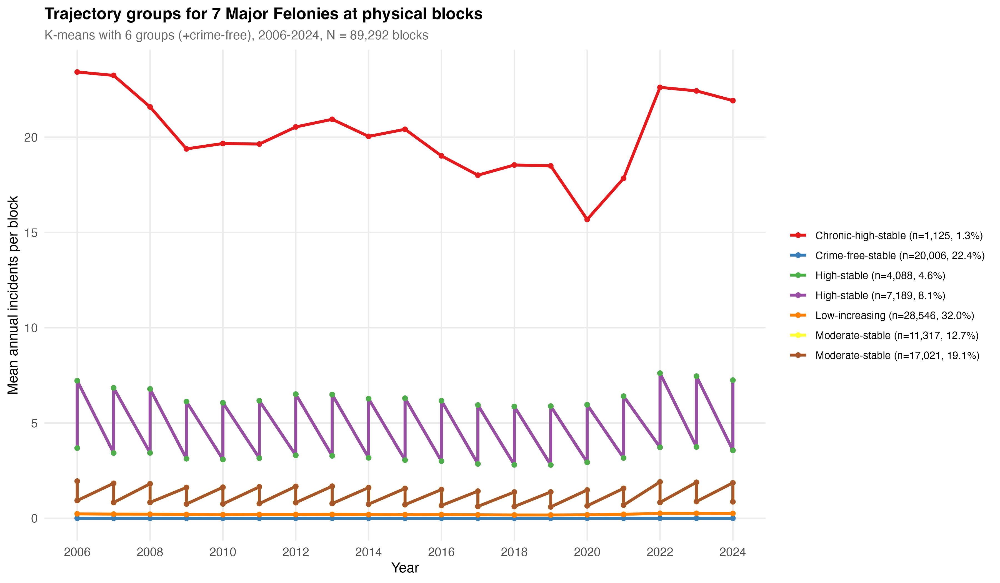
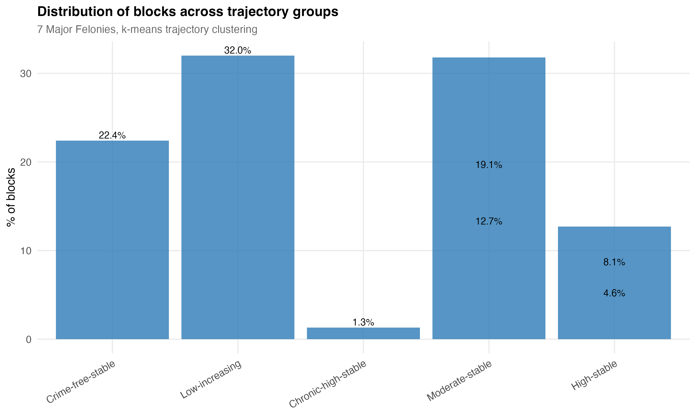
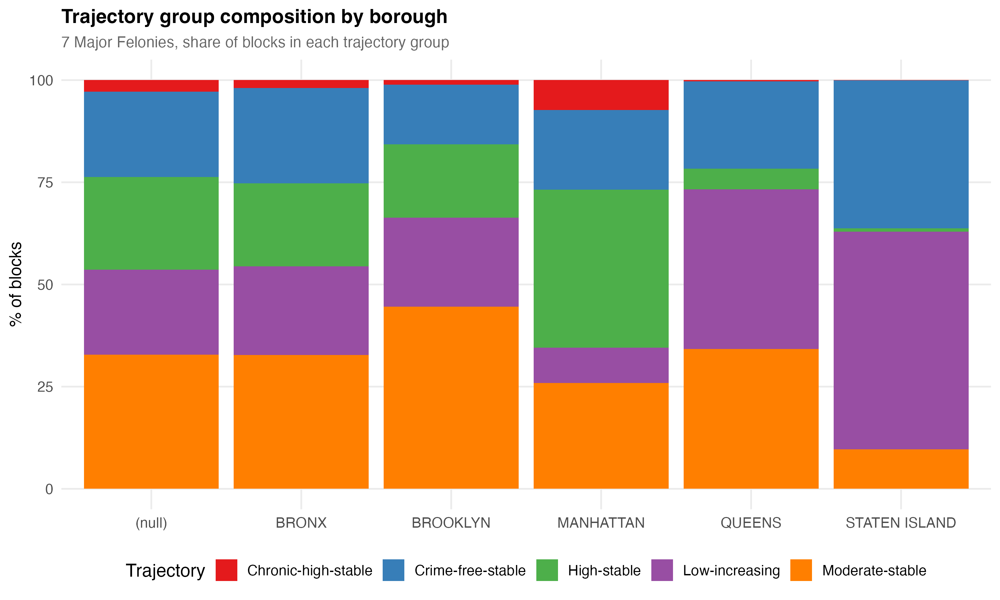
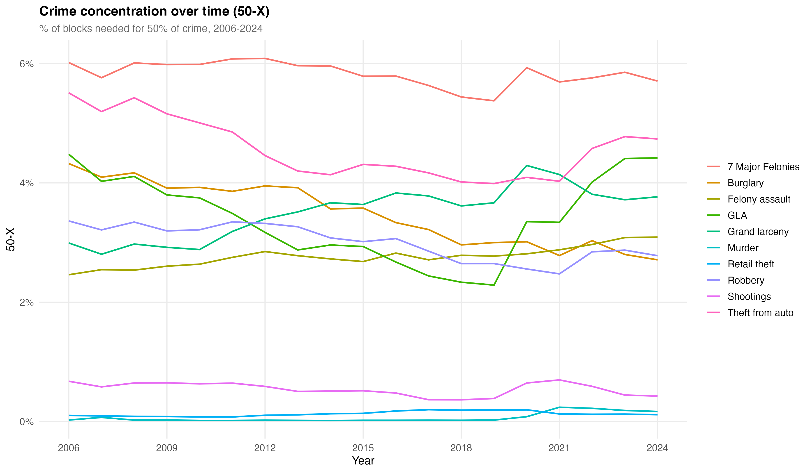
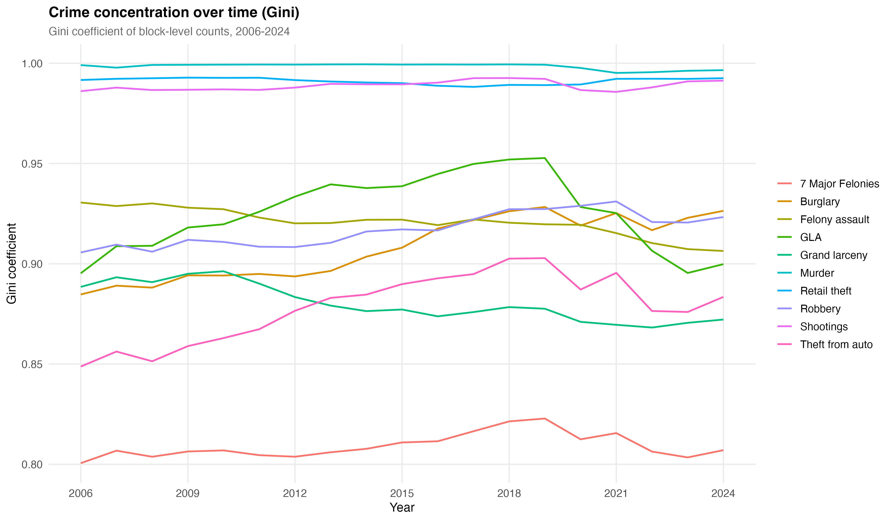
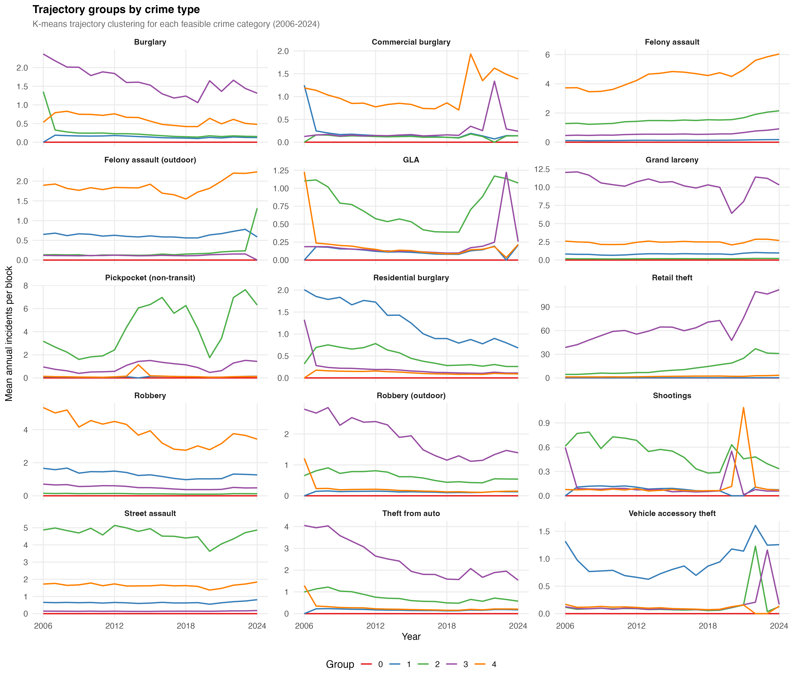
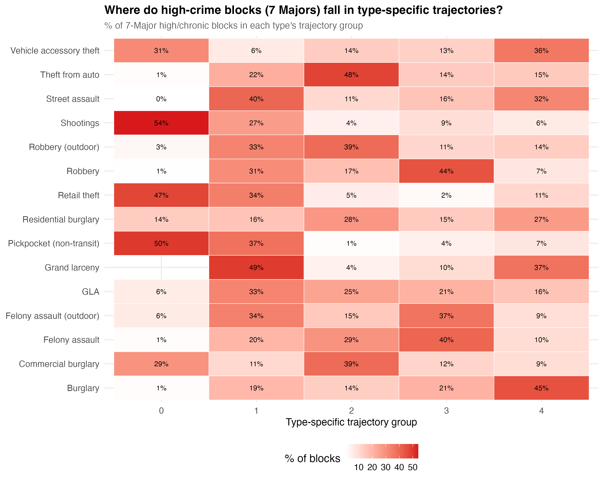
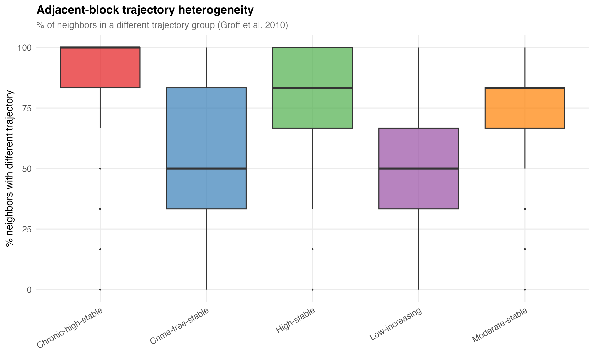
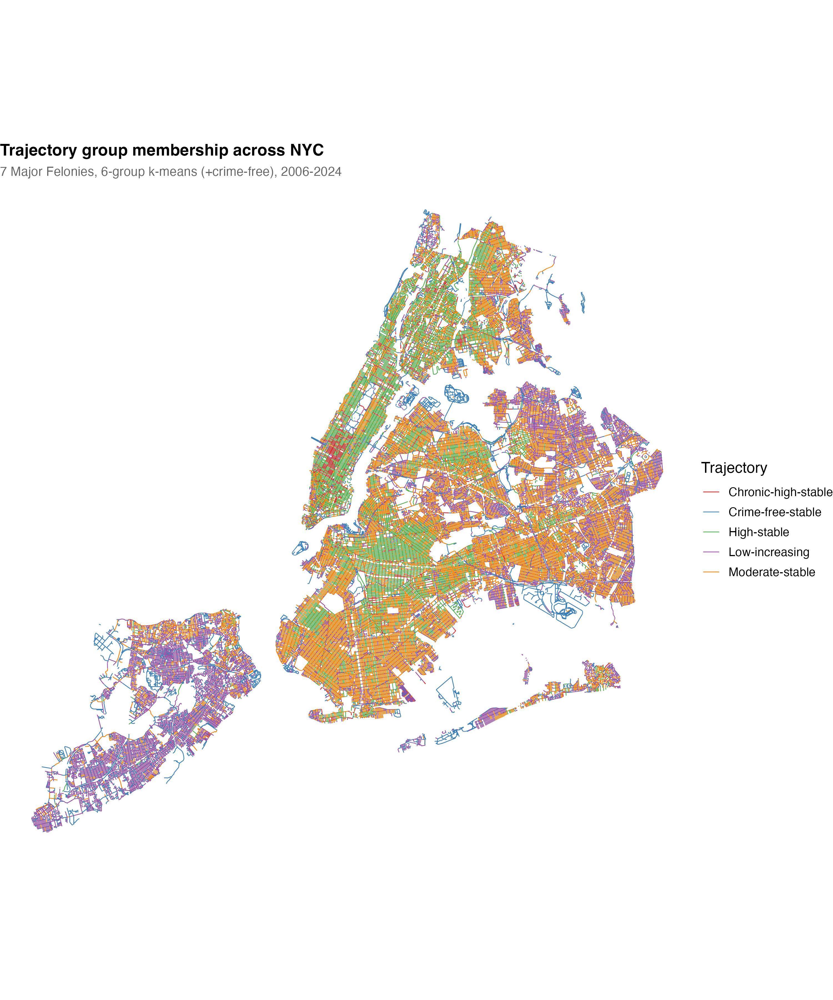

# Trajectory Analysis of Crime at Physical Blocks in New York City, 2006-2024

## Introduction

The law of crime concentration holds that crime clusters at a small number of micro-places. But concentration is a snapshot --- it tells us *where* crime is, not whether those places stay hot, cool down, or heat up. Trajectory analysis addresses this gap by tracking how individual places evolve over time, identifying subgroups that follow distinct developmental paths.

Weisburd, Bushway, Lum, and Yang (2004) pioneered this approach for 29,849 street segments in Seattle over 14 years, finding that 84% of segments followed stable trajectories and that the citywide crime drop was driven by a small subset of declining places, not a uniform shift. The method has since been replicated in Vancouver (Curman, Andresen, and Brantingham, 2015), Albany (Wheeler, Worden, and McLean, 2016), Cincinnati at the address level (Payne and Gallagher, 2016), and most recently across 12 U.S. cities (Luo, 2026).

This analysis extends the trajectory framework to New York City --- the largest U.S. city --- at the physical block level, a spatial unit not previously examined. Using 19 years of NYPD data (2006--2024) across 89,292 physical blocks and 19 crime categories, it asks: Do the foundational findings from Seattle replicate at scale?

---

## Data and Method

### Spatial Unit

The unit of analysis is the **physical block**: a MULTILINESTRING geometry representing one side of a city block between consecutive intersections. New York City contains **89,292** physical blocks, roughly three times the number of street segments in Seattle's foundational study. Physical blocks are not identical to Weisburd's street segments --- they represent block faces rather than centerline segments --- but they serve the same conceptual purpose: micro-places small enough to capture street-level variation.

### Crime Data

Incidents come from two NYPD datasets:
- **NYPD Complaint Data** (2006--2024): all criminal complaints, filtered to valid coordinates and projected to EPSG:2263
- **NYPD Shooting Incidents** (2006--2024): supplemental dataset for gun violence

Each incident was assigned to its nearest physical block using spatial nearest-feature matching. Annual counts were computed for 19 crime categories:

| Category | Definition |
|----------|-----------|
| 7 Major Felonies (aggregate) | Murder, rape, robbery, felony assault, burglary, grand larceny, GLA |
| 7 individual major felonies | Each of the above separately |
| 8 subtypes | Outdoor robbery, outdoor felony assault, street assault, residential burglary, commercial burglary, retail theft, vehicle accessory theft, theft from auto |
| 2 additional | Pickpocket (transit and non-transit), shootings |

This produces a panel of 89,292 blocks x 19 years = **1,696,548** block-year observations per crime type.

### Trajectory Clustering

**K-means clustering** on log-transformed annual counts (`log1p`) was the primary method, following Curman et al. (2015), who demonstrated qualitative equivalence between k-means and Group-Based Trajectory Modeling (GBTM) for crime trajectory classification, with substantial computational advantages for large datasets.

Key methodological choices:

1. **Always-zero separation.** Blocks with zero incidents across all 19 years were deterministically assigned to a "Crime-free" group before clustering. This avoids the common pitfall where k-means wastes a cluster center on near-zero blocks.

2. **Log transformation.** `log1p(count)` compresses the scale so that k-means distinguishes trajectory *shapes* --- the temporal pattern of rising, falling, or stable crime --- rather than just *levels*.

3. **Group number selection.** For 7 Major Felonies, k=6 non-zero groups were selected based on literature precedent (Weisburd et al. typically find 6--8 groups) and visual elbow analysis. The Calinski-Harabasz index was unreliable for zero-inflated count data (biased toward k=2). For individual crime types, k=4 non-zero groups were used.

4. **GBTM validation.** A zero-inflated Poisson GBTM (via the `crimCV` R package) was estimated on a 2,000-block random subsample with 6 groups, achieving BIC = 101,238. Cross-tabulation confirmed structural concordance: each GBTM group mapped systematically to 1--2 k-means groups, validating that the trajectory structure is not an artifact of the clustering method.

---

## Results

### 1. One in Four Blocks Had Zero Major Felonies Across 19 Years

Of the 89,292 physical blocks, **20,006 (22.4%)** recorded zero 7 Major Felony incidents across the entire 2006--2024 period. These blocks --- nearly one in four --- represent a substantial population of crime-free places that has received little attention in the concentration literature. They are not marginal: they constitute the single largest trajectory group.

### 2. Seven Trajectory Groups for Major Felonies

K-means clustering (k=6 plus the crime-free group) identified seven distinct trajectory groups for the 7 Major Felonies aggregate:

| Group | Label | N Blocks | % of Blocks | % of Crime | Mean Annual Count |
|:-----:|-------|:--------:|:-----------:|:----------:|:-----------------:|
| 0 | Crime-free stable | 20,006 | 22.4% | 0.0% | 0.00 |
| 6 | Low-moderate stable | 17,021 | 19.1% | 11.7% | 0.75 |
| 2 | Low-increasing | 28,546 | 32.0% | 5.4% | 0.21 |
| 1 | Moderate stable | 11,317 | 12.7% | 17.0% | 1.65 |
| 4 | High stable | 7,189 | 8.1% | 21.1% | 3.23 |
| 5 | High stable | 4,088 | 4.6% | 24.1% | 6.49 |
| 3 | Chronic-high stable | 1,125 | 1.3% | 20.7% | 20.18 |

The trajectory plot shows the estimated developmental courses. Most groups are flat --- consistent with temporal stability. The low-increasing group (Group 2) shows a modest upward trend, while the chronic-high group maintains dramatically elevated levels throughout the period.

### 3. Temporal Stability Replicates

Approximately **68%** of blocks followed stable trajectories --- crime-free, low-stable, moderate-stable, or high-stable groups with minimal temporal variation. This falls within the range documented in the literature:

| Study | City | Spatial Unit | Years | % Stable |
|-------|------|-------------|:-----:|:--------:|
| Weisburd et al. (2004) | Seattle | Street segments | 14 | 84% |
| Curman et al. (2015) | Vancouver | Street segments | 16 | ~70% |
| Wheeler et al. (2016) | Albany | Street segments | 8 | ~75% |
| **This study** | **NYC** | **Physical blocks** | **19** | **68%** |

The slight shortfall may reflect NYC's larger scale and greater heterogeneity, or the longer observation window (19 vs. 8--16 years) capturing more temporal variation. Regardless, the core finding of the trajectory literature replicates: the majority of places are temporally stable in their crime levels, whether crime-free, low-crime, or high-crime.

### 4. Extreme Concentration at the Top

The chronic-high group (Group 3) contained only **1,125 blocks --- 1.3% of the total --- but accounted for 20.7% of all 7 Major Felony incidents** over the 19-year period. These are blocks averaging over 20 felonies per year, every year, for nearly two decades.

When combined with the two high-stable groups (Groups 4 and 5):

> **13.9% of blocks produced 65.8% of all major felony crime over 19 years.**

This is consistent with Payne and Gallagher's (2016) finding in Cincinnati, where 2.5% of addresses generated one-third of crime. The concentration is more extreme than annual cross-sectional snapshots reveal, because trajectory analysis identifies blocks that are *persistently* high --- not just high in any single year.

### 5. The NYC Crime Decline Was Not Uniform

The existence of a "low-increasing" group --- 32% of blocks showing modest upward trends --- alongside stable and potentially declining groups implies that the well-documented NYC crime decline was not a uniform citywide phenomenon. If it were, all trajectory groups would show proportional decreases.

Instead, the trajectory distribution suggests that the crime drop was driven by specific places transitioning downward while others remained stable or even increased. This mirrors Weisburd et al.'s (2004) central finding in Seattle: citywide trends are composites of divergent place-level trajectories.

### 6. Borough Variation

Trajectory group membership varies substantially across boroughs:

Key patterns:

- **Manhattan** has the highest share of chronic-high blocks (**7.3%**), reflecting the concentration of commercial and nightlife activity. It also has the highest share of high-stable blocks (19.2% and 19.4% for the two high groups).
- **Staten Island** is dominated by low-increasing (53.2%) and crime-free (36.2%) blocks, with only **10 chronic-high blocks** (0.07%) across the entire borough.
- **Queens** shows a similar pattern to Staten Island: 39.0% low-increasing, 21.4% crime-free, and only 86 chronic-high blocks (0.3%).
- **Brooklyn** has the most even distribution across groups, with 20.7% moderate-stable and 23.9% low-moderate stable.
- **The Bronx** mirrors the citywide average, with 23.3% crime-free and 1.9% chronic-high.

---

## Concentration Trends Over Time

Annual 50-X (the percentage of blocks accounting for 50% of crime) and Gini coefficients were computed for all 19 crime categories across all 19 years, providing a 19 x 19 panel of concentration measures.

Key patterns:

- **7 Major Felonies**: 50-X remained in the **5.4--6.1%** range across the entire period, confirming that the "law of crime concentration" bandwidth (Weisburd, 2015) holds for NYC at the physical block level. Roughly 6% of blocks consistently account for half of all major felony crime.

- **Murder and shootings**: The most concentrated crime types, with 50-X values well below 1%. This is expected --- lethal violence is driven by a tiny number of locations.

- **Grand larceny and theft from auto**: The least concentrated among major felonies (50-X of 3.6--5.5%), consistent with property crimes having more diffuse opportunity structures.

- **Temporal stability**: Concentration levels remained remarkably stable over the 19-year period across most crime types, even as absolute crime counts changed substantially. The Gini coefficient for 7 Major Felonies hovered between 0.80 and 0.82 throughout. This stability of the concentration *parameter* --- even as crime rises and falls --- is itself a key finding, supporting the "law" framing.

- **Retail theft**: An outlier. The 50-X remained extremely low (0.08--0.20%), reflecting the reality that retail theft concentrates at a tiny number of commercial locations. The Gini exceeded 0.99 in every year.

---

## Sparsity and Type-Specific Trajectories

Not all crime types are amenable to trajectory modeling at the block-annual level. Three categories were too sparse:

| Crime Type | % Always-Zero Blocks | Nonzero Blocks | Assessment |
|-----------|:-------------------:|:--------------:|-----------|
| Murder | 97.1% | 2,590 | Too sparse for GBTM |
| Rape | 99.9% | 78 | Data artifact (likely geocoding issues) |
| Pickpocket (transit) | 99.4% | 516 | Too sparse for GBTM |

For these types, only descriptive concentration measures (50-X, Gini) over time are reported.

The remaining **16 crime types** --- including the 7 Major Felonies aggregate, robbery, felony assault, burglary, grand larceny, GLA, shootings, and 9 subtypes --- were each modeled with k-means (k=4 non-zero groups + crime-free).

The type-specific trajectories reveal important variation:

- **Robbery** and **felony assault** show the clearest chronic-high tails: about 1% of blocks in a persistently elevated group.
- **Grand larceny** has fewer always-zero blocks (31.5%) than any other individual type --- unsurprising given its volume and broad spatial distribution.
- **Shootings** are extremely concentrated: 88.0% of blocks had zero shootings across all 19 years, and only 1.3% of blocks were in the highest trajectory group.
- **Retail theft** is the most concentrated type modeled: 85.7% always-zero, with a tiny chronic group of 251 blocks (0.3%) capturing a disproportionate share.

### Cross-Type Concordance

Are the same blocks chronically high across different crime types, or does the "worst" set of places differ depending on the offense?

The concordance analysis reveals partial but imperfect overlap. Blocks in the chronic-high trajectory for 7 Major Felonies (Group 3, N=1,125) were disproportionately likely to be in the highest groups for individual types, but the correspondence is not one-to-one. For example:

- Of the 1,125 chronic-high blocks for 7 Majors, **600 (53%)** were in the highest robbery group --- but 342 were in the second-highest, meaning some chronic-high blocks have moderate rather than extreme robbery.
- For felony assault, **610 (54%)** of chronic-high blocks were in the highest assault group.
- For grand larceny, **724 (64%)** were in the highest larceny group, reflecting the volume dominance of this offense.

This partial concordance suggests that chronic hot spots are driven by a *mix* of crime types, not a single dominant offense --- consistent with the general opportunity and social disorganization explanations for persistent concentration.

---

## Spatial Heterogeneity: Good Blocks in Bad Neighborhoods

A central claim of the micro-place literature is that crime varies dramatically within neighborhoods --- that "good blocks" exist adjacent to "bad blocks." Following Groff, Weisburd, and Yang (2010), adjacent-block trajectory heterogeneity was assessed using k=6 nearest neighbors (centroid-based, since physical blocks are line geometries rather than polygons).

On average, **62.7%** of a block's six nearest neighbors were in a different trajectory group. For blocks in the chronic-high group specifically, **77.7%** of neighbors followed a different trajectory. Even the most dangerous blocks in the city are typically surrounded by blocks with very different crime profiles.

**Local Moran's I** analysis found only **15,524 blocks (17.4%)** in statistically significant spatial clusters (p < 0.05). The remaining 82.6% of blocks are *not* spatially clustered with like-trajectory neighbors. Spatial heterogeneity dominates over homogeneity at this scale.

This confirms the micro-place thesis: crime concentration operates at a finer spatial scale than neighborhood-level analyses can capture. Neighborhood averages obscure the street-to-street variation that trajectory analysis reveals.

---

## Citywide Map

The map reveals the spatial distribution of trajectory groups across the city. Chronic-high blocks (red) are concentrated in Manhattan's commercial corridors and select areas of the Bronx and Brooklyn, while crime-free blocks (light colors) dominate Staten Island, eastern Queens, and residential neighborhoods throughout the outer boroughs. The visual confirms the heterogeneity finding: even within visually "hot" areas, blocks of different trajectory types are interspersed.

---

## Discussion

### What Replicates

The foundational findings from Seattle replicate in New York City at scale:

1. **Temporal stability.** The majority of places (68%) follow stable trajectories, whether crime-free, low, moderate, or high. Crime levels at micro-places are remarkably persistent over nearly two decades.

2. **Extreme concentration at the top.** A tiny fraction of places (1.3%) accounts for a disproportionate share of crime (20.7%). This chronic concentration is more extreme than cross-sectional snapshots suggest.

3. **Heterogeneous crime decline.** The citywide crime drop is a composite of divergent place-level trajectories --- not a uniform shift. Some places improved while others remained stable or worsened.

4. **Street-to-street variation.** Adjacent blocks frequently differ in their trajectory group, confirming that neighborhood-level analyses mask critical micro-level variation.

### What NYC Adds

1. **Scale.** With 89,292 physical blocks over 19 years, this is the largest trajectory analysis of crime at micro-places conducted to date. The findings hold in a city with far more heterogeneity than Seattle, Albany, or Vancouver.

2. **Crime-type disaggregation.** Modeling 16 crime types separately reveals that concentration patterns are crime-specific: the "worst" blocks for robbery are not always the "worst" blocks for grand larceny or retail theft.

3. **The crime-free population.** Nearly one in four blocks recorded zero major felonies over 19 years. This stable, crime-free majority --- representing thousands of city blocks --- has been largely invisible in a literature focused on hot spots.

4. **Physical blocks as a spatial unit.** This is the first trajectory analysis at the physical block level, contributing to the growing evidence that concentration findings are robust across spatial definitions (street segments, addresses, grid cells, physical blocks).

### Methodological Caveats: The GBTM Critique Literature

The trajectory groups reported here should be interpreted as convenient summaries of continuous heterogeneity, not as evidence of discrete "types" of places. A substantial methodological literature warns against reifying trajectory groups:

**Skardhamar (2010)** demonstrated through simulation that SPGM/GBTM recovers seemingly distinct trajectory groups even from data generated with no true groups --- where continuous heterogeneity and state dependence alone produce the observed patterns. Standard diagnostics (AvePP > 0.7, OCC > 5) were satisfied in a majority of simulations despite the absence of real groups. Worse, group-specific covariate effects appeared statistically different across groups even though the true effect was uniform. The implication: trajectory groups "emerge from the data" in a trivially true sense, but this does not constitute evidence that the groups reflect discrete underlying processes.

**Erosheva, Matsueda, and Telesca (2014)** reviewed two decades of GBTM and growth mixture modeling in criminology and psychology. Their key findings: (1) within-group variability is typically high relative to between-group differences --- in 8 of 9 studies that plotted individual trajectories within groups, individual variability swamped group separation; (2) the number of groups recovered is sensitive to study design features (observation frequency, time span, outcome type) rather than reflecting stable population structure; (3) researchers routinely discard groups that differ only in level or timing, biasing results toward the conclusion that groups are distinct. They recommend treating trajectory groups as "approximations of a more complex reality" and plotting individual trajectories within groups to assess separation.

**Bauer and Curran (2003, 2004)**, cited extensively in the above reviews, showed that mild nonnormality in outcomes can cause mixture models to extract spurious groups, and that group-specific predictor effects can be distorted when groups are artifacts of distributional misspecification.

**Implications for this analysis.** Our use of k-means rather than parametric GBTM partially sidesteps some concerns (k-means makes no distributional assumptions), but the fundamental problem applies to any discrete clustering of continuous data. The 62.7% spatial heterogeneity finding --- blocks in the same neighborhood assigned to different groups --- could reflect either genuine micro-level variation or the discretization of a smooth spatial gradient. The TODO items (neighborhood trajectory distribution analysis and Chalfin sparse-data correction) directly address these concerns.

For this study, trajectory groups are best understood as a data reduction tool for summarizing longitudinal patterns, not as evidence of discrete place types with distinct causal mechanisms.

### Limitations

1. Physical blocks are not identical to street segments. Direct comparison of group percentages across studies requires caution.

2. K-means does not produce posterior probabilities. Model-based uncertainty is only available from the 2,000-block GBTM validation subsample.

3. The 19-year window may be too long for some crime types, as opportunity structures and policing patterns change over two decades.

4. Murder, rape, and transit pickpocket are too sparse at the block-annual level for trajectory modeling.

5. Crime data reflect reported/recorded incidents. Reporting rates vary by crime type and may shift over time, potentially confounding trajectory shapes.

6. Trajectory groups are discrete approximations of continuous heterogeneity (Skardhamar, 2010; Erosheva et al., 2014). Group boundaries are analytic constructs, not natural kinds.

---

## Technical Appendix

### Software
- R 4.x with `tidyverse`, `sf`, `spdep`, `crimCV`, `janitor`
- Spatial projection: EPSG:2263 (NAD83 / New York Long Island, feet)

### Replication Files
- Script: `scripts/10-trajectory_analysis.R`
- Data outputs in `output/05-trajectory_analysis/`:
  - `trajectory_assignments_7majors.csv` --- block-level group assignments
  - `trajectory_summary_by_type.csv` --- group distributions for each crime type
  - `annual_concentration_by_type.csv` --- 50-X and Gini by type and year
  - `cross_type_concordance.csv` --- cross-tabulation of trajectory groups across crime types
  - `sparsity_assessment.csv` --- always-zero percentages by type
  - `spatial_heterogeneity.csv` --- neighbor trajectory differences
  - `borough_trajectory_composition.csv` --- borough-level trajectory shares
  - `gbtm_bic_7majors.csv` --- GBTM validation BIC values
